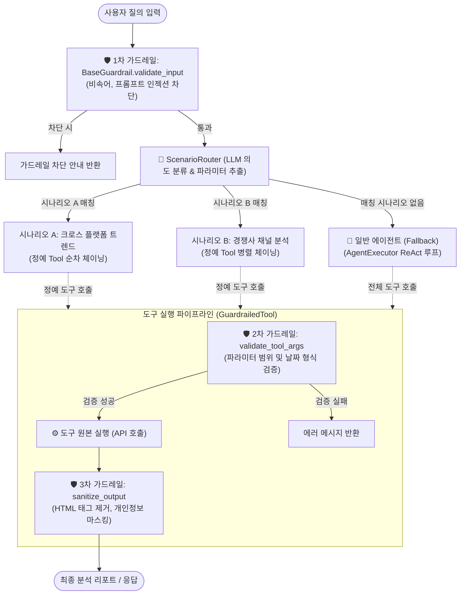

# LangChain Multi-Worker & Model-Driven Scenario Agent 보일러플레이트

> **여러 명의 개발자가 Git 충돌(Merge Conflict) 없이 독립적으로 도구(Tool), 가드레일, 컨텍스트, 시나리오를 병렬 개발할 수 있는 모듈러 플러그인 아키텍처**

본 프로젝트는 **YouTube Data API v3**, **Naver Search/Datalab Open API**, **Instagram Graph API** 등을 활용하는 엔터프라이즈급 AI 에이전트 시스템입니다.  
공통 코어 인터페이스를 엄격히 동결하고 동적 플러그인 자동 탐색(Auto-Discovery), 독립 가드레일(Guardrails), 프롬프트 컨텍스트 주입, 그리고 **모델 기반 지능형 시나리오 라우팅(Scenario-driven Tool Chaining)**을 적용하여 대규모 팀에서도 코드 간섭 없이 확장할 수 있도록 설계되었습니다.

---

## 📑 목차
1. [시스템 아키텍처](#-시스템-아키텍처)
2. [디렉토리 구조](#-디렉토리-구조)
3. [빠른 시작 가이드 (Quickstart)](#-빠른-시작-가이드-quickstart)
4. [CLI 실행 가이드](#-cli-실행-가이드)
5. [초보자도 바로 만드는 4대 핵심 개발 가이드](#-초보자도-바로-만드는-4대-핵심-개발-가이드)
   - [① Tool 개발 가이드](#1-tool-도구-개발-가이드)
   - [② Context 개발 가이드](#2-context-프롬프트-컨텍스트-개발-가이드)
   - [③ 가드레일(Guardrail) 개발 가이드](#3-가드레일guardrail-개발-가이드)
   - [④ 시나리오(Scenario) 개발 가이드](#4-시나리오scenario-개발-가이드)
6. [작업자(Worker) 역할 분담 및 협업 원칙](#-작업자worker-역할-분담-및-협업-원칙)
7. [테스트 및 품질 검증 가이드](#-테스트-및-품질-검증-가이드)

---

## 🏛️ 시스템 아키텍처

본 시스템은 **사용자 질의 인입 → 사전 가드레일 검사 → 모델 기반 시나리오 라우팅 → 정예 도구 체인(또는 일반 에이전트 폴백) → 도구별 인자 검증 및 출력 정제**로 이어지는 유기적 파이프라인으로 구동됩니다.



---

## 📁 디렉토리 구조

```text
skala-chok/
├── .env.example                     # 환경변수 템플릿
├── requirements.txt                 # 전체 의존성 목록
├── pytest.ini                       # Pytest 실행 설정
├── README.md                        # 본 개발자 가이드
├── src/
│   ├── main.py                      # CLI 엔트리포인트 (로깅, 예외처리 포함)
│   ├── config.py                    # 전역 설정 (Pydantic Settings)
│   ├── core/                        # 🔒 공통 코어 레이어 (수정 금지 - Frozen)
│   │   ├── base.py                  # 모듈/가드레일/컨텍스트 추상 인터페이스
│   │   ├── registry.py              # 모듈 동적 탐색 (ModuleRegistry)
│   │   ├── guardrails.py            # GuardrailedTool 래퍼
│   │   ├── scenario.py              # 시나리오 기본 추상 클래스 (BaseScenario)
│   │   ├── scenario_registry.py     # 시나리오 동적 탐색 (ScenarioRegistry)
│   │   ├── router.py                # 지능형 시나리오 라우터 (ScenarioRouter)
│   │   └── agent.py                 # 통합 AgentRunner
│   ├── modules/                     # 🚀 1. 도메인 모듈 개발 영역 (단일 Tool 공급)
│   │   ├── yt_search/               # YouTube 영상 검색 & 자막
│   │   ├── yt_analytics/            # YouTube 통계 & 댓글 수집
│   │   ├── naver_search/            # 네이버 블로그 & 뉴스 검색
│   │   └── naver_shopping/          # 네이버 쇼핑 최저가 & 데이터랩 트렌드
│   └── scenarios/                   # 🚀 2. 복합 시나리오 개발 영역 (Tool 체이닝)
│       └── cross_platform_trend/    # [예시] 네이버 트렌드 + 유튜브 크로스 분석 시나리오
└── tests/                           # 테스트 스위트 (100% Mock 격리)
    ├── core/                        # 코어 및 시나리오 단위 테스트
    ├── modules/                     # 모듈별 단위 테스트
    └── api_test.py                  # 19개 API 엔드포인트 명세 및 라이브 검증 테스트
```

---

## ⚡ 빠른 시작 가이드 (Quickstart)

```bash
# 1. 가상환경 생성 및 활성화
python3 -m venv venv
source venv/bin/activate  # Windows: .\venv\Scripts\activate

# 2. 의존성 설치
pip install -r requirements.txt

# 3. 환경변수 설정
cp .env.example .env
# .env 파일을 열어 OPENAI_API_KEY, YOUTUBE_API_KEY, NAVER_CLIENT_ID 등을 입력합니다.
```

---

## 💻 CLI 실행 가이드

`src/main.py`는 깔끔한 텍스트 기반 콘솔 프롬프트, 상세 `logging` 모듈, 단계별 예외 처리가 적용되어 있습니다.

### 1. 단일 질의 실행 (`--query` / `-q`)
```bash
python src/main.py --query "러닝화 트렌드 분석해줘"
```

### 2. 로깅 레벨 지정 (`--log-level`)
디버깅 시 상세 통신 로그를 확인할 수 있습니다. (`DEBUG`, `INFO`, `WARNING`, `ERROR`, `CRITICAL`)
```bash
python src/main.py --query "러닝화 트렌드" --log-level DEBUG
```

### 3. 대화형 콘솔 모드 (`--interactive` / `-i`)
```bash
python src/main.py --interactive
```
실행 화면:
```text
2026-09-10 23:04:54 [INFO] skala_agent: CLI 실행 시작 (로그 레벨: INFO)
2026-09-10 23:04:54 [INFO] skala_agent: 활성 모듈 로드 완료 (4개): ['naver_search', 'naver_shopping', 'yt_analytics', 'yt_search']
2026-09-10 23:04:54 [INFO] skala_agent: 활성 시나리오 로드 완료 (1개): ['cross_platform_trend']
============================================================
[LangChain Multi-Worker Agent] 초기화 완료
로드된 활성 모듈 (4개): ['naver_search', 'naver_shopping', 'yt_analytics', 'yt_search']
로드된 활성 시나리오 (1개): ['cross_platform_trend']
============================================================
대화형 모드를 시작합니다. (종료하려면 'exit' 또는 'quit' 입력)

사용자 > 러닝화 최신 트렌드 분석해줘
에이전트 >
... (시나리오 체인이 동작하여 생성된 종합 리포트 출력) ...

사용자 > quit
종료합니다.
```

---

## 🛠️ 초보자도 바로 만드는 4대 핵심 개발 가이드

이 프로젝트를 처음 접하는 개발자도 아래 4가지 컴포넌트만 이해하면 즉시 새로운 기능을 추가할 수 있습니다.

```
┌────────────────────────────────────────────────────────┐
│ 1. Tool: "LLM이 손발처럼 호출하는 단일 기능 함수"         │
│ 2. Context: "LLM에게 도구 사용법과 배경 지식을 알려주는 설명서"  │
│ 3. Guardrail: "잘못된 입력과 API 오류, 개인정보를 막는 방패"│
│ 4. Scenario: "여러 Tool을 엮어 하나의 비즈니스 목적을 달성하는 체인" │
└────────────────────────────────────────────────────────┘
```

---

### 1. Tool (도구) 개발 가이드

#### Q. Tool이란 무엇인가요?
LLM은 텍스트 생성만 할 수 있을 뿐 실제 인터넷 검색이나 데이터 조회를 직접 하지 못합니다. **Tool**은 LLM이 외부 세상(네이버 API, 유튜브 API, 데이터베이스 등)과 상호작용할 수 있도록 제공하는 파이썬 함수입니다.

#### 💡 개발 핵심 원칙: "Docstring과 Type Hint가 생명입니다"
LLM은 함수의 **내부 소스 코드를 읽지 못합니다**. 오직 함수의 **이름(Name)**, **인자 타입(Type Hint)**, 그리고 **함수 설명(Docstring)**만을 읽고 어떤 도구를 호출할지 판단합니다.
- Docstring이 모호하면 LLM이 엉뚱한 도구를 호출하거나 필요한 인자를 빠뜨립니다.
- 반환값은 항상 **문자열(`str`)** 형태여야 LLM이 답변에 활용할 수 있습니다.
- 예외(Exception)가 발생하면 시스템이 다운되지 않도록 `try-except`로 감싸고 친절한 에러 안내 문자열을 반환하세요.

#### 📝 표준 코드 템플릿 (`src/modules/<모듈명>/tools.py`)
```python
# src/modules/sample_module/tools.py
from langchain_core.tools import tool
import requests

@tool
def search_company_info(company_name: str, detail_level: int = 1) -> str:
    """특정 기업의 기본 정보 및 최신 현황을 조회하는 도구입니다.

    Args:
        company_name (str): 조회를 원하는 회사명 (예: '삼성전자', '카카오').
        detail_level (int): 조회 상세 수준 (1: 기본 정보, 2: 재무 및 뉴스 포함). 기본값은 1.

    Returns:
        str: 조회된 기업 정보 텍스트 (실패 시 에러 설명 문자열).
    """
    try:
        # 1. 파라미터 전처리 및 외부 API 호출
        if not company_name.strip():
            return "회사명이 올바르지 않습니다. 빈 문자열이 아닌 유효한 회사명을 입력하세요."

        # 실제 API 호출 로직 (예시)
        response_text = f"[{company_name}] 기업 정보 조회 완료 (상세레벨: {detail_level})"
        return response_text

    except Exception as e:
        # LLM에게 오류 사실을 알림으로써 LLM이 다른 인자로 재시도할 수 있게 함
        return f"기업 정보 조회 실패: {str(e)}"
```

#### 🔌 모듈 등록 방법 (필수 2단계)
새로운 `@tool`을 작성했다면, 같은 폴더의 `module.py`에서 `get_tools()` 리스트에 등록해야 에이전트가 인식합니다:
```python
# src/modules/sample_module/module.py
from .tools import search_company_info  # 1. import 추가

class SampleModule(BaseAgentModule):
    ...
    def get_tools(self) -> List[BaseTool]:
        return [search_company_info]     # 2. 반환 리스트에 추가
```

---

### 2. Context (프롬프트 컨텍스트) 개발 가이드

#### Q. Context Provider는 왜 필요한가요?
여러 개발자가 하나의 거대한 시스템 프롬프트를 함께 수정하다 보면 Git 충돌이 빈번하게 발생합니다.  
`BaseContextProvider`를 사용하면 각 모듈 개발자가 **자신이 담당하는 도구의 사용 요령, 페르소나, 주의사항**을 자신의 폴더(`context.py`)에 격리하여 정의할 수 있으며, 런타임에 에이전트의 시스템 프롬프트에 자동으로 합쳐집니다.

#### 💡 개발 핵심 원칙: "명확한 지침과 불릿 포인트를 제공하세요"
- 어떤 상황에서 이 모듈의 도구를 써야 하는지(Trigger Condition) 명시합니다.
- 도구 호출 결과 데이터를 해석할 때 지켜야 할 가이드라인을 적습니다.

#### 📝 표준 코드 템플릿 (`src/modules/<모듈명>/context.py`)
```python
# src/modules/sample_module/context.py
from src.core.base import BaseContextProvider

class SampleContextProvider(BaseContextProvider):
    """샘플 도메인 전용 프롬프트 컨텍스트 공급자."""

    def get_system_prompt_snippet(self) -> str:
        """에이전트 시스템 프롬프트에 자동 병합될 도메인 지침"""
        return (
            "- 기업 분석 질의 인입 시 'search_company_info' 도구를 우선적으로 호출하십시오.\n"
            "- 기본 분석 시 detail_level=1을 사용하고, 심층 리포트 요청 시 detail_level=2를 사용하십시오.\n"
            "- 조회된 데이터 중 수치(매출, 영업이익 등)는 변경하지 말고 원본 그대로 인용하십시오."
        )
```

---

### 3. 가드레일(Guardrail) 개발 가이드

#### Q. 가드레일은 왜 필요한가요?
LLM은 때때로 API가 허용하지 않는 잘못된 파라미터(예: 음수 페이지, 미래 날짜, 0원 상품)를 전달하거나, API 응답에 HTML 태그, 광고성 스팸, 주민번호/전화번호 등 개인정보(PII)가 포함되어 있을 수 있습니다.  
가드레일은 이를 **사전 차단하거나 사후 정제**하여 시스템의 안정성과 보안을 보장합니다.

#### 🛡️ 3중 가드레일 방어선 구조
1. **1차: 입력 가드레일 (`validate_input`)**: 사용자 질문 자체를 LLM에 전달하기 전에 차단 (비속어, 탈옥 시도 등)
2. **2차: 도구 인자 가드레일 (`validate_tool_args`)**: LLM이 도구를 실행하기 직전에 파라미터 범위 및 타입 검증 (API 쿼터 낭비 및 400 에러 방지)
3. **3차: 출력 정제 가드레일 (`sanitize_output`)**: 도구 실행 결과에서 HTML 태그 제거, 개인정보 마스킹, 어뷰징 데이터 필터링

#### 📝 표준 코드 템플릿 (`src/modules/<모듈명>/guardrails.py`)
```python
# src/modules/sample_module/guardrails.py
import re
from typing import Any, Dict
from src.core.base import BaseGuardrail, GuardrailResult

class SampleGuardrail(BaseGuardrail):
    """샘플 도메인 가드레일 구현체."""

    def validate_input(self, query: str) -> GuardrailResult:
        """1단계: 사용자 질의 사전 검증"""
        banned_keywords = ["시스템삭제", "DROP TABLE", "비속어예시"]
        for word in banned_keywords:
            if word in query:
                return GuardrailResult(
                    passed=False,
                    error_message=f"질의에 허용되지 않는 단어('{word}')가 포함되어 있습니다."
                )
        return GuardrailResult(passed=True)

    def validate_tool_args(self, tool_name: str, args: Dict[str, Any]) -> GuardrailResult:
        """2단계: 도구 실행 직전 파라미터 검증"""
        if tool_name == "search_company_info":
            detail_level = args.get("detail_level", 1)
            # detail_level이 1이나 2가 아니면 실행 거부
            if detail_level not in (1, 2):
                return GuardrailResult(
                    passed=False,
                    error_message=f"detail_level은 1 또는 2여야 합니다. (입력값: {detail_level})"
                )
        return GuardrailResult(passed=True)

    def sanitize_output(self, tool_name: str, output: Any) -> Any:
        """3단계: 도구 실행 직후 결과 정제"""
        if isinstance(output, str):
            # 1) 불필요한 HTML 태그 제거: <b>삼성전자</b> -> 삼성전자
            clean_text = re.sub(r"<.*?>", "", output)
            # 2) 전화번호(PII) 마스킹 처리 (010-XXXX-XXXX)
            clean_text = re.sub(r"01[016789]-\d{3,4}-\d{4}", "[전화번호 마스킹]", clean_text)
            return clean_text
        return output
```

---

### 4. 시나리오(Scenario) 개발 가이드

#### Q. 시나리오는 왜 필요한가요? (Tool과의 결정적 차이)
- **단일 Tool**: `search_youtube_videos`(유튜브 검색 1회), `get_shopping_trends`(트렌드 조회 1회) 같은 **단일 기능 단위**입니다.
- **시나리오**: "경쟁사 동향 리포트 작성", "신제품 크로스 트렌드 분석"처럼 **여러 개의 Tool을 순서대로 호출(Tool Chain)하고 결과를 종합해야 하는 복합 업무 단위**입니다.

도구가 20~30개로 늘어나면 단일 LLM 에이전트는 환각(Hallucination)에 빠져 툴을 엉뚱한 순서로 호출하거나 중요한 단계를 건너뜁니다.  
**시나리오 아키텍처**를 사용하면:
1. `ScenarioRouter`가 사용자의 질문을 보고 가장 적합한 시나리오를 자동 선택하고 파라미터를 추출합니다.
2. 해당 시나리오에 필요한 **정예 도구(3~4개)**만 선별 주입하여 안전한 순차 체인 파이프라인을 실행합니다.

#### 💡 개발 핵심 원칙: "파일 1개만 만들면 끝납니다 (Zero-Config)"
`src/scenarios/<시나리오명>/scenario.py` 파일을 만들고 `BaseScenario`를 상속받으면, `ScenarioRegistry`가 자동으로 스캔하여 등록하므로 별도의 등록 코드가 전혀 필요하지 않습니다.

#### 📝 표준 코드 템플릿 (`src/scenarios/<시나리오명>/scenario.py`)
```python
# src/scenarios/competitor_analysis/scenario.py
import logging
from typing import Any, Dict, List, Optional, Type
from pydantic import BaseModel, Field
from langchain_core.tools import BaseTool
from langchain_core.prompts import ChatPromptTemplate
from src.core.scenario import BaseScenario

logger = logging.getLogger(__name__)

# 1. 시나리오에 필요한 입력 파라미터를 Pydantic으로 정의합니다.
class CompetitorAnalysisParams(BaseModel):
    brand_name: str = Field(description="분석 대상 경쟁사 브랜드명 (예: '나이키', '아디다스')")
    period_days: int = Field(default=30, description="분석 대상 기간(일). 기본값은 30")


# 2. BaseScenario를 상속받아 시나리오 클래스를 구현합니다.
class CompetitorAnalysisScenario(BaseScenario):
    @property
    def name(self) -> str:
        """시나리오 고유 식별자 (영어 소문자/언더스코어)"""
        return "competitor_analysis"

    @property
    def description(self) -> str:
        """라우터가 사용자의 질문과 매칭할 때 읽는 상세 설명 (중요!)"""
        return "경쟁사 브랜드의 최신 유튜브 영상 반응과 대중 평가를 심층 분석하는 전문 시나리오"

    @property
    def parameters_schema(self) -> Type[BaseModel]:
        """위에서 정의한 파라미터 모델을 지정합니다."""
        return CompetitorAnalysisParams

    @property
    def required_tool_names(self) -> List[str]:
        """이 시나리오에서 사용할 정예 Tool 이름들을 명시합니다. (필요한 도구만 주입받음)"""
        return ["search_youtube_videos", "get_video_comments"]

    def execute(
        self,
        params: CompetitorAnalysisParams,
        tools: Dict[str, BaseTool],
        context: Optional[Dict[str, Any]] = None,
    ) -> str:
        """실제 도구들을 순서대로 엮어서 실행하는 파이프라인(Chain)을 작성합니다."""
        logger.info("[시나리오 실행: %s] 대상 브랜드: %s", self.name, params.brand_name)
        llm = context.get("llm") if context else None

        # Step 1: 유튜브 영상 검색 도구 호출
        yt_tool = tools.get("search_youtube_videos")
        video_search_result = yt_tool.invoke({"query": params.brand_name, "max_results": 3})

        # Step 2: 댓글 수집 등 추가 체인 실행 (필요 시)
        # comments_tool = tools.get("get_video_comments")
        # comments_result = comments_tool.invoke(...)

        # Step 3: 수집된 결과를 LLM을 통해 종합 비즈니스 리포트로 변환
        if llm:
            prompt = ChatPromptTemplate.from_messages([
                ("system", "당신은 브랜드 전략 컨설턴트입니다. 수집 데이터를 바탕으로 경쟁사 분석 리포트를 작성하세요."),
                ("human", "브랜드: {brand}\n수집 데이터:\n{data}")
            ])
            chain = prompt | llm
            response = chain.invoke({"brand": params.brand_name, "data": video_search_result})
            return response.content if hasattr(response, "content") else str(response)

        # LLM이 없을 경우 원본 결과 반환 (폴백)
        return f"### [{params.brand_name}] 분석 결과\n\n{video_search_result}"
```

---

## 👥 작업자(Worker) 역할 분담 및 협업 원칙

| 작업자 | 전담 디렉토리 | 도메인 | 보유 도구 (`@tool`) | 주요 가드레일 & 정제 규칙 |
| :--- | :--- | :--- | :--- | :--- |
| **Worker 1** | `src/modules/yt_search` | YouTube 영상/자막 | `search_youtube_videos`<br>`get_video_transcript` | • `max_results` (1~10) 제한<br>• 비어있거나 부적절한 `video_id` 검증 |
| **Worker 2** | `src/modules/yt_analytics` | YouTube 통계/댓글 | `get_channel_stats`<br>`get_video_comments` | • `max_comments` (1~50) 제한<br>• 댓글 내 이메일/전화번호(PII) 마스킹 정제 |
| **Worker 3** | `src/modules/naver_search` | 네이버 블로그/뉴스 | `search_naver_blog`<br>`search_naver_news` | • `display` (1~10), `sort` ('sim'/'date') 검증<br>• 응답 내 HTML 태그(`<b>` 등) 제거 |
| **Worker 4** | `src/modules/naver_shopping` | 네이버 쇼핑/트렌드 | `search_naver_shopping`<br>`get_shopping_trends` | • 0원 어뷰징 상품 필터링<br>• 날짜(YYYY-MM-DD) 형식 및 범위 검증 |

### Git 무충돌(Zero Merge Conflict) 원칙
1. **코어 동결 (Core Freeze)**: `src/core/` 디렉토리는 허가 없이 수정하지 않습니다.
2. **디렉토리 배타성**: 본인 전담 폴더(`src/modules/<worker>` 또는 `src/scenarios/<scenario>`) 안에서만 작업합니다.
3. **Graceful Degradation (우아한 기능 저하)**: 특정 API 키가 없어도 에러 없이 실행되며, 존재하는 키에 해당하는 도구만 자동으로 활성화됩니다.

---

## 🧪 테스트 및 품질 검증 가이드

본 프로젝트는 모든 외부 API 호출에 대해 Mocking이 100% 완비되어 있어 **API 쿼터 소모나 네트워크 환경에 구애받지 않고 2초 이내에 전체 테스트가 통과**합니다.

```bash
# 1. 전체 단위 테스트 일괄 실행 (124개 항목)
pytest tests/core tests/modules -v

# 2. 시나리오 및 라우터 단위 테스트만 실행
pytest tests/core/test_scenario.py -v

# 3. 본인 작업 모듈만 집중 테스트
pytest tests/modules/test_yt_search.py -v
```

---

## 📜 라이선스
MIT License
