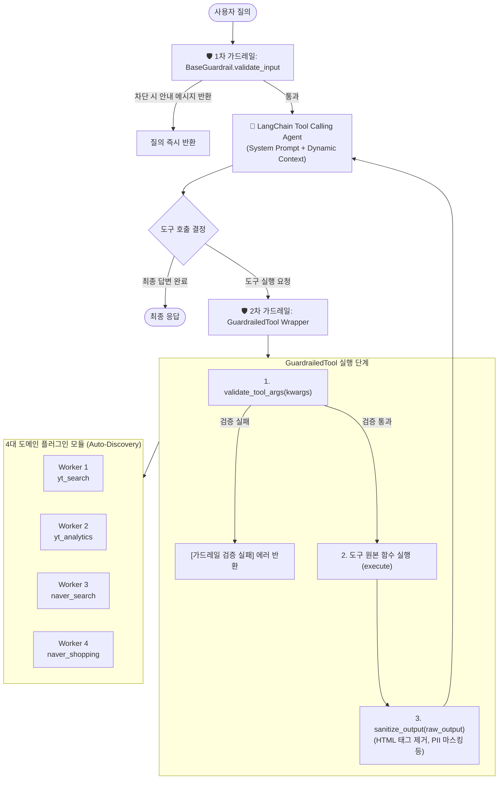

# 🚀 LangChain Multi-Worker Agent Boilerplate

> **4명의 개발자가 단일 LLM 에이전트 프로젝트에서 Git 충돌(Merge Conflict) 없이 독립적으로 모듈을 동시 병렬 개발할 수 있는 모듈러 플러그인 기반 보일러플레이트**

본 프로젝트는 **YouTube Data API v3**와 **Naver Search/Datalab Open API**를 활용하는 다중 도메인 AI 에이전트 시스템입니다.  
공통 코어 인터페이스를 엄격히 동결하고 동적 플러그인 자동 탐색(Auto-Discovery), 독립 가드레일(Guardrails), 컨텍스트 주입(Context Provider) 메커니즘을 적용하여 개발자 간 코드 간섭을 완전히 차단합니다.

---

## 📑 목차
1. [시스템 아키텍처](#-시스템-아키텍처)
2. [디렉토리 구조](#-디렉토리-구조)
3. [4개 작업자(Worker) 역할 분담 및 협업 원칙](#-4개-작업자worker-역할-분담-및-협업-원칙)
4. [빠른 시작 가이드 (Quickstart)](#-빠른-시작-가이드-quickstart)
5. [CLI 실행 가이드](#-cli-실행-가이드)
6. [모듈 개발 및 확장 가이드](#-모듈-개발-및-확장-가이드)
7. [테스트 및 품질 검증 가이드](#-테스트-및-품질-검증-가이드)

---

## 🏛️ 시스템 아키텍처

본 시스템은 **사용자 질의 입력부터 도구 호출 결정, 인자 검증, 도구 실행 및 결과 정제**에 이르기까지 3중 가드레일 파이프라인으로 보호됩니다.



---

## 📁 디렉토리 구조

```text
skala-chok/
├── .env.example                     # 환경변수 템플릿 파일
├── requirements.txt                 # 전체 의존성 라이브러리 목록
├── pytest.ini                       # Pytest 기본 설정 (asyncio 모드 등)
├── README.md                        # 프로젝트 개발자 가이드
├── src/
│   ├── __init__.py
│   ├── main.py                      # CLI 엔트리포인트 (단일 질의 및 대화형 모드)
│   ├── config.py                    # 환경변수 및 전역 설정 (Pydantic Settings)
│   ├── core/                        # 🔒 공통 코어 레이어 (수정 금지 - Frozen)
│   │   ├── __init__.py
│   │   ├── base.py                  # 표준 추상 인터페이스 (BaseAgentModule, BaseGuardrail, BaseContextProvider)
│   │   ├── guardrails.py            # GuardrailedTool 래퍼 및 파이프라인 검증 로직
│   │   ├── registry.py              # 모듈 동적 탐색 및 레지스트리 (ModuleRegistry)
│   │   └── agent.py                 # LangChain AgentRunner 및 에이전트 조립 로직
│   └── modules/                     # 🚀 작업자 독립 개발 영역 (작업자별 폴더 격리)
│       ├── __init__.py
│       ├── yt_search/               # [Worker 1] 동영상 검색 & 자막 추출
│       │   ├── client.py            # 외부 API 클라이언트
│       │   ├── tools.py             # LangChain @tool 정의
│       │   ├── context.py           # 시스템 프롬프트 주입 스니펫
│       │   ├── guardrails.py        # 도메인 가드레일 (인자 검증 & 정제)
│       │   └── module.py            # BaseAgentModule 구현체
│       ├── yt_analytics/            # [Worker 2] 채널 통계 & 댓글 분석
│       │   ├── client.py, tools.py, context.py, guardrails.py, module.py
│       ├── naver_search/            # [Worker 3] 블로그 & 뉴스 검색
│       │   ├── client.py, tools.py, context.py, guardrails.py, module.py
│       └── naver_shopping/          # [Worker 4] 쇼핑 최저가 & 트렌드 분석
│           ├── client.py, tools.py, context.py, guardrails.py, module.py
└── tests/
    ├── conftest.py                  # 공통 Pytest Fixture
    ├── core/                        # 코어 레이어 단위 테스트
    │   ├── test_base.py
    │   ├── test_registry.py
    │   └── test_agent.py
    ├── modules/                     # 작업자별 독립 단위 테스트 (Mock 기반)
    │   ├── test_yt_search.py
    │   ├── test_yt_analytics.py
    │   ├── test_naver_search.py
    │   └── test_naver_shopping.py
    ├── test_config.py               # 설정값 검증 테스트
    └── test_integration.py          # 4개 모듈 전체 통합 및 E2E 테스트
```

---

## 👥 4개 작업자(Worker) 역할 분담 및 협업 원칙

### 1. 역할 분담 표

| 작업자 | 전담 디렉토리 | 도메인 | 보유 도구 (`@tool`) | 주요 가드레일 & 정제 규칙 |
| :--- | :--- | :--- | :--- | :--- |
| **Worker 1** | `src/modules/yt_search` | YouTube 영상/자막 | `search_youtube_videos`<br>`get_video_transcript` | • `max_results` (1~10) 제한<br>• 비어있거나 부적절한 `video_id` 검증 |
| **Worker 2** | `src/modules/yt_analytics` | YouTube 통계/댓글 | `get_channel_stats`<br>`get_video_comments` | • `max_comments` (1~50) 제한<br>• 댓글 내 이메일/전화번호(PII) 마스킹 정제 |
| **Worker 3** | `src/modules/naver_search` | 네이버 블로그/뉴스 | `search_naver_blog`<br>`search_naver_news` | • `display` (1~10), `sort` ('sim'/'date') 검증<br>• 응답 내 HTML 태그(`<b>` 등) 및 엔티티 제거 |
| **Worker 4** | `src/modules/naver_shopping` | 네이버 쇼핑/트렌드 | `search_naver_shopping`<br>`get_shopping_trends` | • 0원 어뷰징 상품 필터링<br>• 날짜(YYYY-MM-DD) 형식 및 범위 검증 |

### 2. Git 무충돌(Zero Merge Conflict) 협업 원칙
1. **코어 동결 (Core Freeze)**:  
   `src/core/` 디렉토리는 팀 리더 또는 아키텍트의 승인 없이 절대 수정하지 않습니다. 모든 비즈니스 로직은 `src/modules/<worker_dir>` 내부에서 완결합니다.
2. **독립 브랜치 & 디렉토리 배타성**:
   - Worker 1: `feature/yt-search` (`src/modules/yt_search/`, `tests/modules/test_yt_search.py`)
   - Worker 2: `feature/yt-analytics` (`src/modules/yt_analytics/`, `tests/modules/test_yt_analytics.py`)
   - Worker 3: `feature/naver-search` (`src/modules/naver_search/`, `tests/modules/test_naver_search.py`)
   - Worker 4: `feature/naver-shopping` (`src/modules/naver_shopping/`, `tests/modules/test_naver_shopping.py`)
3. **Graceful Degradation (우아한 기능 저하)**:  
   본인에게 네이버 API 키가 없더라도 YouTube 모듈을 로컬에서 정상 실행 및 개발할 수 있습니다. `ModuleRegistry`는 API 키가 부재한 모듈(`is_enabled() == False`)을 자동으로 제외하고 활성화 가능한 모듈만 조립하여 에이전트를 가동합니다.

---

## ⚡ 빠른 시작 가이드 (Quickstart)

### 1. 가상환경 생성 및 활성화
```bash
python3 -m venv venv
source venv/bin/activate  # macOS / Linux
# Windows: .\venv\Scripts\activate
```

### 2. 패키지 설치
```bash
pip install -r requirements.txt
```

### 3. 환경변수 설정 (`.env`)
`.env.example` 파일을 복사하여 `.env`를 생성하고 필요한 API 키를 입력합니다.
```bash
cp .env.example .env
```

`.env` 설정 항목:
```ini
# OpenAI 설정 (에이전트 LLM 구동용)
OPENAI_API_KEY=your_openai_api_key_here
MODEL_NAME=gpt-4o-mini
TEMPERATURE=0.0

# Worker 1 & Worker 2 (Google Cloud Console 발급)
YOUTUBE_API_KEY=your_youtube_api_key_here

# Worker 3 & Worker 4 (Naver Developers 발급)
NAVER_CLIENT_ID=your_naver_client_id_here
NAVER_CLIENT_SECRET=your_naver_client_secret_here
```
> 💡 **참고**: 로컬 개발 시 본인이 담당하지 않는 모듈의 API 키는 비워두어도 무방합니다.

---

## 💻 CLI 실행 가이드

`src/main.py`를 통해 에이전트를 실행할 수 있습니다.

### 1. 단일 질의 모드 (`--query` / `-q`)
터미널에서 1회성 질문을 실행하고 결과를 출력합니다.
```bash
python -m src.main --query "LangChain 최신 튜토리얼 블로그 글 찾아줘"
```

### 2. 대화형 콘솔 모드 (`--interactive` / `-i`)
대화형 셸이 실행되어 연속적인 질의응답을 수행합니다. (인자 없이 실행 시 기본 모드로 동작)
```bash
python -m src.main --interactive
```
실행 화면 예시:
```text
============================================================
🚀 [LangChain Multi-Worker Agent] 초기화 완료
📦 로드된 활성 모듈 (4개): ['yt_search', 'yt_analytics', 'naver_search', 'naver_shopping']
============================================================
대화형 모드를 시작합니다. (종료하려면 'exit' 또는 'quit' 입력)

👤 사용자 > 아이폰 16 관련 최신 뉴스와 쇼핑 최저가 비교해줘
🤖 에이전트 >
... (도구 호출 및 가드레일 정제 과정을 거쳐 생성된 최종 응답) ...

👤 사용자 > quit
종료합니다.
```

---

## 🧩 모듈 개발 및 확장 가이드

신규 기능을 개발하거나 기존 모듈을 수정할 때는 표준 **4대 컴포넌트(`client`, `tools`, `context`, `guardrails`)**와 **모듈 선언(`module.py`)** 규격을 준수해야 합니다.

### 1. 표준 4대 컴포넌트 구현 상세

#### ① `client.py` - 외부 통신 계층
외부 REST API 또는 SDK를 호출합니다. 테스트 시 `requests.get` 또는 관련 라이브러리가 쉽게 Mocking될 수 있도록 간결하게 작성합니다.
```python
# src/modules/sample_module/client.py
import requests
from src.config import settings

class SampleClient:
    def fetch_data(self, query: str) -> dict:
        url = "https://api.example.com/v1/search"
        params = {"q": query, "key": settings.SAMPLE_API_KEY}
        resp = requests.get(url, params=params, timeout=5)
        resp.raise_for_status()
        return resp.json()
```

#### ② `tools.py` - LangChain 도구 계층
LangChain의 `@tool` 데코레이터를 사용하여 LLM이 호출할 도구를 정의합니다. docstring과 타입 힌트는 LLM의 Tool Calling 정확도에 직접적인 영향을 미치므로 명확히 기술합니다.
```python
# src/modules/sample_module/tools.py
from langchain_core.tools import tool
from .client import SampleClient

client = SampleClient()

@tool
def search_sample(query: str, count: int = 5) -> str:
    """Search sample items by query. count must be between 1 and 10."""
    try:
        data = client.fetch_data(query=query)
        items = data.get("items", [])
        if not items:
            return "검색 결과가 없습니다."
        return "\n".join([f"- {it['title']}: {it['desc']}" for it in items[:count]])
    except Exception as e:
        return f"검색 실패: {str(e)}"
```

#### ③ `guardrails.py` - 안전 및 데이터 정제 계층
`BaseGuardrail`을 상속받아 3개 메서드 중 필요한 항목을 오버라이딩합니다.
- `validate_input(query)`: 사용자 입력 프롬프트 자체를 사전 검증
- `validate_tool_args(tool_name, args)`: 도구 실행 직전 파라미터 유효성 검증
- `sanitize_output(tool_name, output)`: 도구 실행 직후 결과 정제 (태그 제거, 개인정보 마스킹 등)
```python
# src/modules/sample_module/guardrails.py
import re
from typing import Any, Dict
from src.core.base import BaseGuardrail, GuardrailResult

class SampleGuardrail(BaseGuardrail):
    def validate_tool_args(self, tool_name: str, args: Dict[str, Any]) -> GuardrailResult:
        if tool_name == "search_sample":
            count = args.get("count", 5)
            if count > 10 or count < 1:
                return GuardrailResult(passed=False, error_message="count는 1 이상 10 이하여야 합니다.")
        return GuardrailResult(passed=True)

    def sanitize_output(self, tool_name: str, output: Any) -> Any:
        if isinstance(output, str):
            # HTML 태그 제거
            return re.sub(r"<.*?>", "", output)
        return output
```

#### ④ `context.py` - 프롬프트 컨텍스트 계층
`BaseContextProvider`를 상속하여 에이전트의 시스템 프롬프트에 동적으로 결합될 도메인 지침을 제공합니다.
```python
# src/modules/sample_module/context.py
from src.core.base import BaseContextProvider

class SampleContextProvider(BaseContextProvider):
    def get_system_prompt_snippet(self) -> str:
        return (
            "- 샘플 도메인 질의 시 'search_sample' 도구를 활용하십시오.\n"
            "- 검색된 결과를 기반으로 핵심 내용을 불릿 포인트로 요약하십시오."
        )
```

#### ⑤ `module.py` - 모듈 선언 및 등록
`BaseAgentModule`을 구현하여 위 컴포넌트들을 하나로 묶습니다. `src/modules/` 아래에 본 클래스를 정의해두면 `ModuleRegistry`가 런타임에 자동으로 탐색하여 등록합니다.
```python
# src/modules/sample_module/module.py
from typing import List
from langchain_core.tools import BaseTool
from src.config import settings
from src.core.base import BaseAgentModule, BaseGuardrail, BaseContextProvider
from .tools import search_sample
from .guardrails import SampleGuardrail
from .context import SampleContextProvider

class SampleModule(BaseAgentModule):
    @property
    def name(self) -> str:
        return "sample_module"

    @property
    def description(self) -> str:
        return "샘플 도메인 검색 모듈"

    def is_enabled(self) -> bool:
        # 필요한 API 키 존재 여부 확인
        return bool(getattr(settings, "SAMPLE_API_KEY", None))

    def get_tools(self) -> List[BaseTool]:
        return [search_sample]

    def get_guardrails(self) -> List[BaseGuardrail]:
        return [SampleGuardrail()]

    def get_context_provider(self) -> BaseContextProvider:
        return SampleContextProvider()
```

---

## 🧪 테스트 및 품질 검증 가이드

본 보일러플레이트는 모든 외부 API 호출에 대해 단위 테스트 격리(Mocking)를 100% 적용하여 **인터넷 연결이나 API 쿼터 소모 없이 1초 내외로 모든 테스트가 통과**하도록 구성되어 있습니다.

### 1. 작업자별 전담 단위 테스트 실행
작업자는 자신의 모듈 작업 시 아래와 같이 본인 모듈의 테스트만 집중 실행할 수 있습니다.
```bash
# Worker 1: YouTube 동영상 검색 및 자막 추출
pytest tests/modules/test_yt_search.py -v

# Worker 2: YouTube 채널 통계 및 댓글 분석
pytest tests/modules/test_yt_analytics.py -v

# Worker 3: 네이버 블로그 및 뉴스 검색
pytest tests/modules/test_naver_search.py -v

# Worker 4: 네이버 쇼핑 및 데이터랩 트렌드
pytest tests/modules/test_naver_shopping.py -v
```

### 2. 코어 인터페이스 및 통합 테스트 실행
```bash
# 코어 레이어 테스트
pytest tests/core/ -v

# 전체 4개 모듈 통합 및 E2E 테스트
pytest tests/test_integration.py -v
```

### 3. 전체 테스트 스위트 일괄 실행 (PR 제출 전 필수)
```bash
pytest -v
```
**통과 기준**: 99개 이상의 테스트 항목이 100% `PASSED` 되어야 합니다.

---

## 📜 라이선스
MIT License
