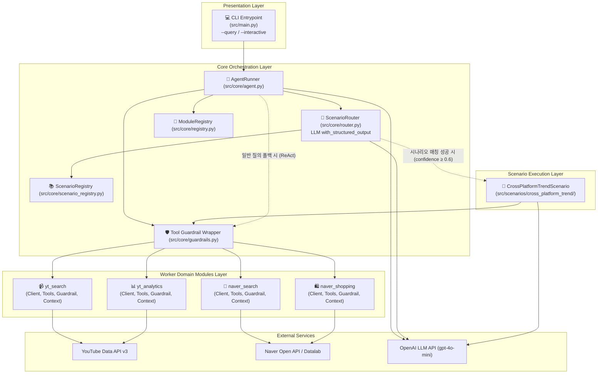
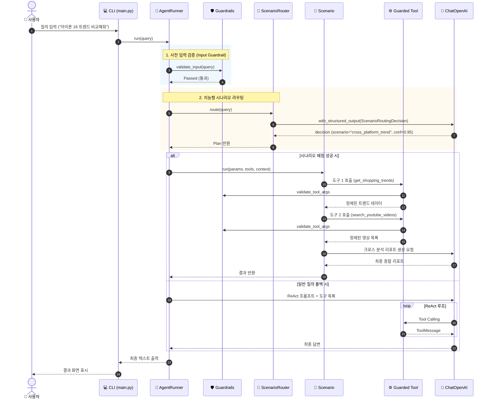

# 🏛️ 2. 현재 코드 아키텍처 구조 (System Architecture)

본 문서는 `skala-chok` 프로젝트의 전체 소프트웨어 구조, 핵심 컴포넌트 간 상호작용, 런타임 제어 흐름 및 확장 메커니즘을 상세히 설명합니다.

---

## 🗺️ 1. 전체 시스템 아키텍처 개요

본 시스템은 **"플러그인 기반 멀티 워커 에이전트(Plugin-based Multi-Worker Agent) 및 지능형 시나리오 라우팅(Scenario Routing)"** 아키텍처를 채택하고 있습니다.



---

## 🧩 2. 계층별 상세 역할 및 책임

### 2.1 Presentation 계층 (`src/main.py`)
- **역할**: 사용자와 상호작용하는 콘솔 인터페이스.
- **주요 기능**:
  - 단일 질의 모드 (`--query "질문"`) 및 대화형 셸 모드 (`--interactive`) 지원.
  - 로그 레벨 동적 제어 (`--log-level DEBUG/INFO`).
  - 시스템 초기화 시 활성화된 모듈 및 시나리오 목록 대시보드 출력.

---

### 2.2 Core 오케스트레이션 계층 (`src/core/`)

#### ① `AgentRunner` (`src/core/agent.py`)
- 에이전트의 전체 라이프사이클을 조율하는 중앙 오케스트레이터.
- `ModuleRegistry`로부터 활성화된 모듈들을 취합하고, 도구에 가드레일을 래핑(`wrap_tool_with_guardrails`).
- 도메인별 컨텍스트 프로바이더로부터 시스템 프롬프트를 동적 조합.
- 사용자 입력 수신 시:
  1. **사전 가드레일 검증 (`validate_input`)**: 악성 또는 빈 입력 즉각 차단.
  2. **시나리오 라우팅 (`ScenarioRouter.route`)**: 전문 시나리오 체인으로 분기.
  3. **일반 에이전트 폴백 (`AgentExecutor`)**: 시나리오 미매칭 시 ReAct 루프로 처리.

#### ② `ScenarioRouter` (`src/core/router.py`)
- 사용자의 자연어 요청을 분석하여 등록된 전문 시나리오 중 가장 적합한 시나리오를 선택.
- LangChain의 `with_structured_output(ScenarioRoutingDecision)`과 LCEL 파이프라인을 활용하여 시나리오명, 신뢰도(0.0~1.0), 추출된 파라미터를 구조화된 객체로 판정.
- 신뢰도 임계치(`confidence_threshold=0.6`) 미달 시 안전하게 일반 에이전트로 폴백.

#### ③ `ModuleRegistry` (`src/core/registry.py`)
- `src.modules` 패키지 하위의 `module.py` 파일들을 런타임에 리플렉션(Reflection) 기반으로 자동 탐색(`discover_modules`).
- 각 모듈의 `is_enabled()`를 호출하여 필수 API 키/설정 존재 여부에 따라 활성/비활성 분류.

#### ④ `ScenarioRegistry` (`src/core/scenario_registry.py`)
- `src.scenarios` 하위의 `scenario.py` 파일들을 자동 탐색하여 레지스트리에 등록.

#### ⑤ `wrap_tool_with_guardrails` (`src/core/guardrails.py`)
- 개별 LangChain `BaseTool`을 감싸는 프록시 래퍼.
- **사전(Pre-execution)**: `validate_tool_args`로 인자 유효성 검사 (실패 시 도구 실행 차단).
- **실행(Execution)**: 실행 시간(Latency) 측정 및 디버그 로깅.
- **사후(Post-execution)**: `sanitize_output`으로 민감 정보 마스킹 및 HTML 태그 정제.

---

### 2.3 모듈 표준 4대 컴포넌트 구조 (`src/modules/<module_name>/`)

각 도메인 워커는 상호 격리된 독립 패키지로 구성되며, 반드시 아래 5개 파일로 구성됩니다:

```
src/modules/naver_search/
├── client.py       # 1. 외부 REST API 통신 계층 (HTTP 호출 및 응답 파싱)
├── tools.py        # 2. LangChain 도구 계층 (@tool 데코레이터 및 Docstring)
├── guardrails.py   # 3. 안전 및 데이터 정제 계층 (BaseGuardrail 상속)
├── context.py      # 4. 시스템 프롬프트 주입 계층 (BaseContextProvider 상속)
└── module.py       # 5. 모듈 선언 및 컴포넌트 바인딩 (BaseAgentModule 상속)
```

1. **`client.py`**: 외부 API(REST/SDK)와 통신. 순수 Python 함수/클래스로 작성되어 테스트 시 Mocking이 용이함.
2. **`tools.py`**: LLM이 호출할 도구를 정의. `client`를 호출하고 결과를 문자열로 반환.
3. **`guardrails.py`**: 인자 검증(`validate_tool_args`) 및 반환값 마스킹(`sanitize_output`) 수행.
4. **`context.py`**: 해당 도메인 도구를 올바르게 사용하도록 시스템 프롬프트 스니펫 제공.
5. **`module.py`**: 위 4개 요소를 묶어 `BaseAgentModule`을 구현.

---

### 2.4 전문 시나리오 계층 (`src/scenarios/<scenario_name>/`)
- **역할**: 도구들을 단순 나열하여 LLM에게 전부 맡기는 대신, 정형화된 비즈니스 파이프라인(예: 트렌드 분석 $\rightarrow$ 콘텐츠 검색 $\rightarrow$ 교차 리포트)을 결정론적으로 순차/병렬 실행하는 고도화 계층.
- **`CrossPlatformTrendScenario`**:
  - Step 1: `CrossPlatformTrendParams` (Pydantic 인자 검증)
  - Step 2: `get_shopping_trends` (네이버 쇼핑 트렌드 조회)
  - Step 3: `search_youtube_videos` (유튜브 영상 검색)
  - Step 4: LLM 기반 종합 크로스 인사이트 리포트 생성 및 반환.

---

## 🔄 3. 엔드 투 엔드 요청 처리 시퀀스 (Request Flow)


