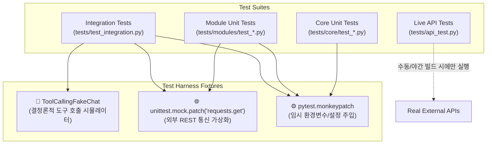

# 🧪 4. 테스트 및 하네스 엔지니어링 가이드 (Testing & Harness Engineering)

본 문서는 `skala-chok` 프로젝트의 테스트 하네스(Test Harness) 아키텍처, 100% Mocking 원칙, 그리고 에이전트 평가(Agent Evaluation) 전략을 설명합니다.

---

## 🎯 1. 하네스 엔지니어링의 목표

하네스 엔지니어링의 핵심 목표는 **"외부 API 의존성(비용, 쿼터, 레이트 리밋, 네트워크 지연)과 LLM 비결정론(Non-determinism)을 완전히 제거하여, 1초 내외로 전체 에이전트 파이프라인의 회귀(Regression)를 완벽히 검증하는 것"**입니다.

### 핵심 달성 지표:
- **실행 속도**: 전체 단위 테스트 스위트가 1~2초 내에 완료되어야 함.
- **비용 제로**: 테스트 수행 시 실제 OpenAI, YouTube, Naver API 호출이 일절 발생하지 않음.
- **재현성 100%**: 언제 어디서 실행해도 동일한 입력에 대해 동일한 테스트 통과 결과를 보장.

---

## 🏗️ 2. 테스트 하네스 아키텍처 및 계층



---

## 🛠️ 3. 핵심 하네스 기법 및 패턴

### 3.1 외부 HTTP 통신 Mocking (`requests.get`)
각 모듈의 `client.py`는 외부 API와 통신하므로, 테스트에서는 `unittest.mock.patch`를 통해 예상되는 JSON 응답 객체를 주입합니다.

```python
from unittest.mock import patch

def test_naver_blog_search_success():
    mock_payload = {
        "items": [
            {"title": "<b>아이폰 16</b> 리뷰", "link": "https://blog.naver.com/test", "description": "상세 리뷰"}
        ]
    }
    with patch("src.modules.naver_search.client.requests.get") as mock_get:
        mock_get.return_value.status_code = 200
        mock_get.return_value.json.return_value = mock_payload

        # 테스트 실행
        client = NaverSearchClient()
        result = client.search_blog("아이폰 16")
        
        # 검증
        assert len(result["items"]) == 1
        mock_get.assert_called_once()
```

---

### 3.2 Tool Calling 에이전트 평가 하네스 (`ToolCallingFakeChat`)
실제 OpenAI API를 호출하지 않고도 에이전트가 어떤 도구를 호출하고 어떻게 반응하는지 검증하기 위해 결정론적 가짜 LLM(`ToolCallingFakeChat`)을 활용합니다.

```python
from langchain_core.messages import AIMessage
from tests.test_integration import ToolCallingFakeChat

def test_agent_tool_calling_flow(monkeypatch):
    # 1. 가짜 LLM의 단계별 응답 정의
    # Step 1: LLM이 도구 호출 명령(AIMessage with tool_calls)을 생성하도록 모킹
    tool_call_msg = AIMessage(
        content="",
        tool_calls=[{
            "name": "search_naver_blog",
            "args": {"query": "LangChain", "display": 3},
            "id": "call_mock_123",
            "type": "tool_call",
        }]
    )
    # Step 2: 도구 결과를 본 후 LLM이 최종 답변을 생성하도록 모킹
    final_ai_msg = AIMessage(content="블로그 검색 결과 요약입니다.")
    
    fake_llm = ToolCallingFakeChat(responses=[tool_call_msg, final_ai_msg])
    
    # 2. 에이전트 러너 구동 및 도구 호출 검증
    runner = AgentRunner(registry=registry, llm=fake_llm)
    res = runner.run("LangChain 블로그 글 찾아줘")
    assert res == "블로그 검색 결과 요약입니다."
```

---

### 3.3 OpenAPI 장애 대응 폴백 목(Fallback Mock) 데이터 하네스 룰

외부 OpenAPI(Naver Search/Shopping, YouTube Data API 등)는 네트워크 불안정, 타임아웃, 일일 쿼터(Quota) 초과, 비인가 키 오류 등 다양한 외부 요인으로 실패할 수 있습니다.
에이전트 시스템 및 테스트 하네스가 외란에 의해 중단(Crash)되지 않도록, **"OpenAPI 호출 실패 시 표준 스키마의 폴백 목(Fallback Mock) 데이터를 반환하고 이를 하네스로 검증한다"**는 하네스 룰을 필수로 준수해야 합니다.

#### 📌 하네스 룰 핵심 요건
1. **Graceful Degradation (우아한 기능 저하)**:
   - 외부 OpenAPI 통신 시 예외(`requests.exceptions.RequestException`, `HTTPError`, `Timeout` 등)가 발생하면 프로세스를 중단시키지 않고 포착(`try-except`)합니다.
   - 실패 원인을 경고 로그(`logger.warning`)로 명확히 기록한 후, 사전에 정의된 **표준 폴백 목 데이터**를 반환합니다.
2. **표준 응답 스키마(Data Contract) 준수**:
   - 폴백 목 데이터는 정상 OpenAPI 응답과 동일한 딕셔너리 키 및 데이터 타입을 유지해야 합니다.
   - 다운스트림(가드레일 `sanitize_output`, LLM ReAct 루프, 시나리오 분석 체인)에서 `KeyError`나 파싱 에러가 발생하지 않도록 방지합니다.
   - 목 데이터 항목 내에 `[Fallback Mock]` 또는 `(오프라인 목 데이터)` 표식을 부여하여, LLM 및 사용자가 해당 데이터가 폴백 결과임을 명확히 인지할 수 있도록 합니다.
3. **하네스 테스트 검증 필수화**:
   - 모든 OpenAPI 클라이언트 및 도구는 **"OpenAPI 실패 시 폴백 목 데이터 반환"** 시나리오를 검증하는 단위 테스트를 반드시 포함해야 합니다.
   - `unittest.mock.patch`의 `side_effect`에 예외를 주입하여 회귀 테스트를 수행합니다.

#### 💻 구현 예시 (클라이언트 계층)
```python
import logging
import requests
from typing import Any, Dict

logger = logging.getLogger(__name__)

class NaverSearchClient:
    # ...
    def _get_fallback_blog_data(self, query: str) -> Dict[str, Any]:
        """OpenAPI 실패 시 반환할 표준 스키마의 폴백 목 데이터."""
        return {
            "total": 1,
            "start": 1,
            "display": 1,
            "items": [
                {
                    "title": f"[Fallback Mock] {query} 관련 오프라인 검색 결과",
                    "link": "https://openapi.naver.com/fallback",
                    "description": "외부 OpenAPI 통신 장애로 인해 제공된 기본 폴백 목 데이터입니다.",
                    "bloggername": "System Fallback",
                    "bloggerlink": "https://openapi.naver.com",
                    "postdate": "20260911",
                }
            ],
        }

    def search_blog(self, query: str, display: int = 5, sort: str = "sim") -> Dict[str, Any]:
        url = f"{self.BASE_URL}/blog.json"
        params = {"query": query, "display": display, "sort": sort}
        try:
            resp = requests.get(url, headers=self.headers, params=params, timeout=5)
            resp.raise_for_status()
            return resp.json()
        except requests.exceptions.RequestException as e:
            logger.warning("OpenAPI 호출 실패, 폴백 목 데이터를 반환합니다: %s", e)
            return self._get_fallback_blog_data(query)
```

#### 🧪 하네스 테스트 작성 예시
```python
from unittest.mock import patch
import requests

def test_naver_blog_search_openapi_failure_fallback():
    """OpenAPI 네트워크 오류 또는 500 에러 발생 시 폴백 목 데이터가 반환되는지 검증."""
    with patch("src.modules.naver_search.client.requests.get") as mock_get:
        # 외부 OpenAPI 실패 시뮬레이션
        mock_get.side_effect = requests.exceptions.ConnectionError("Network unreachable")

        client = NaverSearchClient()
        result = client.search_blog("AI 트렌드")

        # 폴백 목 데이터 스키마 및 식별자 검증
        assert "items" in result
        assert len(result["items"]) >= 1
        assert "[Fallback Mock]" in result["items"][0]["title"]
```

---

## 🏃 4. 테스트 실행 명령어 가이드

```bash
# 1. 작업자별 전담 단위 테스트 (본인 모듈 작업 시)
./venv/bin/pytest tests/modules/test_yt_search.py -v
./venv/bin/pytest tests/modules/test_yt_analytics.py -v
./venv/bin/pytest tests/modules/test_naver_search.py -v
./venv/bin/pytest tests/modules/test_naver_shopping.py -v

# 2. 코어 아키텍처 및 시나리오 단위 테스트
./venv/bin/pytest tests/core/ -v

# 3. 전체 모듈 단위 및 코어 테스트 일괄 실행 (회귀 방지 필수)
./venv/bin/pytest tests/modules/ tests/core/ -q

# 4. (선택) 라이브 API 연동 테스트 (실제 API 키 필요 시)
./venv/bin/pytest tests/api_test.py -v
```
