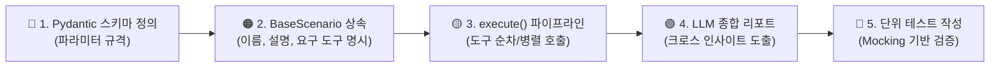

# 🚀 5. 신규 모듈 및 시나리오 확장 가이드 (Extension Guide)

본 문서는 새로운 외부 API를 연동하는 **도메인 모듈(Worker Module)**이나, 여러 도구를 결합하여 복합 분석을 수행하는 **전문 시나리오(Scenario)**를 추가할 때 따라야 하는 표준 절차를 안내합니다.

---

## 🌈 1. 신규 도메인 모듈 추가 절차 (5단계 레인보우 로드맵)

새로운 도메인(예: `google_search`, `weather_info`, `slack_notify`)을 추가할 때는 `src/modules/<module_name>/` 디렉토리를 생성하고 아래 5단계를 순서대로 구현합니다.

```
src/modules/weather_info/
├── client.py        🔴 [Step 1] 외부 API 통신 클라이언트
├── guardrails.py    🟠 [Step 2] 인자 검증 및 출력 정제 가드레일
├── tools.py         🟡 [Step 3] LangChain @tool 도구 함수
├── context.py       🟢 [Step 4] 시스템 프롬프트 컨텍스트 프로바이더
└── module.py        🔵 [Step 5] BaseAgentModule 상속 및 등록
```

---

### 🔴 Step 1: `client.py` 작성 (통신 계층)
외부 REST API 또는 SDK를 호출하는 클래스를 작성합니다. 테스트 시 `requests.get`이 손쉽게 Mocking될 수 있도록 간결하게 구성합니다.

```python
# src/modules/weather_info/client.py
import requests
from src.config import settings

class WeatherClient:
    BASE_URL = "https://api.weather.example.com/v1"

    def get_current_weather(self, city: str) -> dict:
        url = f"{self.BASE_URL}/current"
        params = {"city": city, "apikey": getattr(settings, "WEATHER_API_KEY", "")}
        resp = requests.get(url, params=params, timeout=5)
        resp.raise_for_status()
        return resp.json()
```

---

### 🟠 Step 2: `guardrails.py` 작성 (안전 계층)
`BaseGuardrail`을 상속받아 도구 호출 전 인자 유효성(`validate_tool_args`)과 도구 실행 후 출력 정제(`sanitize_output`)를 구현합니다.

```python
# src/modules/weather_info/guardrails.py
from typing import Any, Dict
from src.core.base import BaseGuardrail, GuardrailResult

class WeatherGuardrail(BaseGuardrail):
    def validate_tool_args(self, tool_name: str, args: Dict[str, Any]) -> GuardrailResult:
        if tool_name == "fetch_weather":
            city = args.get("city", "").strip()
            if not city or len(city) < 2:
                return GuardrailResult(passed=False, error_message="도시 이름은 2글자 이상이어야 합니다.")
        return GuardrailResult(passed=True)

    def sanitize_output(self, tool_name: str, output: Any) -> Any:
        if isinstance(output, str):
            # API 키나 내부 시스템 경로가 노출되지 않도록 마스킹
            return output.replace("INTERNAL_HOST", "[PROTECTED]")
        return output
```

---

### 🟡 Step 3: `tools.py` 작성 (도구 계층)
LangChain의 `@tool` 데코레이터를 사용하여 LLM이 호출할 수 있는 도구를 정의합니다.

```python
# src/modules/weather_info/tools.py
from langchain_core.tools import tool
from .client import WeatherClient

client = WeatherClient()

@tool
def fetch_weather(city: str) -> str:
    """지정한 도시의 현재 기온과 날씨 상태를 조회합니다.
    
    Args:
        city: 날씨를 조회할 한글 또는 영문 도시명 (예: '서울', 'Tokyo').
    """
    try:
        data = client.get_current_weather(city)
        return f"{city}의 현재 날씨: {data.get('condition', '정보 없음')}, 기온: {data.get('temp')}°C"
    except Exception as e:
        return f"날씨 정보 조회 실패: {str(e)}"
```

---

### 🟢 Step 4: `context.py` 작성 (프롬프트 계층)
`BaseContextProvider`를 상속하여 에이전트가 해당 도구를 언제 써야 하는지 시스템 프롬프트 가이드라인을 제공합니다.

```python
# src/modules/weather_info/context.py
from src.core.base import BaseContextProvider

class WeatherContextProvider(BaseContextProvider):
    def get_system_prompt_snippet(self) -> str:
        return (
            "- 사용자가 특정 지역의 날씨, 기온, 우산 필요 여부를 질문할 때 'fetch_weather' 도구를 활용하십시오.\n"
            "- 기온과 상태를 친절하게 안내하고 외출 복장을 추천하십시오."
        )
```

---

### 🔵 Step 5: `module.py` 작성 (모듈 등록)
`BaseAgentModule`을 구현합니다. 이 클래스를 정의해두면 `ModuleRegistry`가 런타임에 자동으로 탐색하여 에이전트에 등록합니다.

```python
# src/modules/weather_info/module.py
from typing import List
from langchain_core.tools import BaseTool
from src.config import settings
from src.core.base import BaseAgentModule, BaseGuardrail, BaseContextProvider
from .tools import fetch_weather
from .guardrails import WeatherGuardrail
from .context import WeatherContextProvider

class WeatherInfoModule(BaseAgentModule):
    @property
    def name(self) -> str:
        return "weather_info"

    @property
    def description(self) -> str:
        return "실시간 날씨 및 기온 정보 조회 모듈"

    def is_enabled(self) -> bool:
        # 필요한 환경변수 설정 여부 체크
        return bool(getattr(settings, "WEATHER_API_KEY", None))

    def get_tools(self) -> List[BaseTool]:
        return [fetch_weather]

    def get_guardrails(self) -> List[BaseGuardrail]:
        return [WeatherGuardrail()]

    def get_context_provider(self) -> BaseContextProvider:
        return WeatherContextProvider()
```

---

## 🎯 2. 신규 전문 시나리오(Scenario) 추가 절차

단순 ReAct 도구 호출을 넘어, 복합 비즈니스 로직 파이프라인을 구축하고 싶을 때는 `src/scenarios/<scenario_name>/scenario.py`를 생성합니다.



### 필수 구현 항목:
1. **파라미터 스키마 (`parameters_schema`)**: 라우터 LLM이 사용자 질문에서 추출할 인자들을 Pydantic `BaseModel`로 정의.
2. **요구 도구 명시 (`required_tool_names`)**: 시나리오 실행에 필수적인 도구들의 이름을 리스트로 선언.
3. **`execute()` 메서드**: 전달받은 `tools` 딕셔너리에서 필요한 도구를 꺼내어 호출하고, 최종적으로 LLM을 활용해 종합 결과물을 생성.
