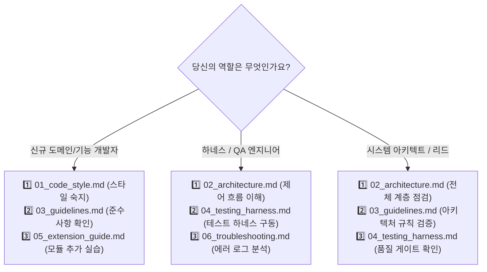

# 🧭 하네스 엔지니어링 인수인계 허브 (Harness Engineering Handoff Index)

환영합니다! 본 디렉토리(`handoff/`)는 **`skala-chok` (LangChain Multi-Worker Agent & Scenario Routing Platform)** 프로젝트의 원활한 유지보수, 테스트 자동화, 그리고 하네스 엔지니어링(Harness Engineering)을 위한 **공식 인수인계 문서 허브**입니다.

새로운 엔지니어, 작업자, 또는 에이전트 평가 담당자가 프로젝트의 설계 철학을 신속히 이해하고 안전하게 코드를 확장할 수 있도록 모든 필수 엔지니어링 가이드를 라우팅합니다.

---

## 🗺️ Handoff 문서 로드맵 및 바로가기

| 순번 | 문서명 | 주요 다루는 내용 | 대상 독자 |
| :---: | :--- | :--- | :---: |
| **01** | [**🎨 코드 스타일 가이드 (`01_code_style.md`)**](./01_code_style.md) | • Python 3.10+ PEP 8 스타일<br>• 클래스/함수/도구 명명 규칙<br>• 엄격한 Type Hinting & Docstring 표준<br>• 모듈 임포트 순서 및 린트 도구 | 전체 개발자 |
| **02** | [**🏛️ 현재 아키텍처 구조 (`02_architecture.md`)**](./02_architecture.md) | • 시스템 전체 계층 구조 (CLI $\rightarrow$ Core $\rightarrow$ Worker $\rightarrow$ API)<br>• 4대 컴포넌트(Client, Tools, Guardrails, Context)<br>• 지능형 시나리오 라우팅 & ReAct 폴백 메커니즘<br>• 엔드투엔드 요청 처리 시퀀스 다이어그램 | 아키텍트 / 코어 개발자 |
| **03** | [**📜 작성 준수 사항 (`03_guidelines.md`)**](./03_guidelines.md) | • **모듈 간 무의존성 원칙** (Zero Cross-Module Dependency)<br>• 3단계 가드레일 구현 필수 규칙<br>• API 키 보안 및 Graceful Degradation<br>• 예외 처리 및 에러 복원력 가이드라인 | 전체 개발자 |
| **04** | [**🧪 테스트 및 하네스 엔지니어링 (`04_testing_harness.md`)**](./04_testing_harness.md) | • **100% Mocking 원칙** (비용 제로, 초고속 검증)<br>• **OpenAPI 실패 대응 폴백 목 데이터 룰**<br>• `ToolCallingFakeChat` 에이전트 평가 하네스<br>• 단위/통합 테스트 스위트 운용 및 회귀 방지 | 하네스 / QA 엔지니어 |
| **05** | [**🚀 신규 모듈/시나리오 확장 가이드 (`05_extension_guide.md`)**](./05_extension_guide.md) | • 5단계 레인보우 로드맵 (🔴 Red $\rightarrow$ 🔵 Blue)<br>• 신규 외부 API Worker 모듈 추가 방법<br>• 신규 전문 시나리오(Scenario) 체이닝 구현 절차 | 기능 개발자 |
| **06** | [**🛠️ 트러블슈팅 및 운영 가이드 (`06_troubleshooting.md`)**](./06_troubleshooting.md) | • 모듈 비활성화 / 가드레일 인자 차단 대응<br>• 라우터 스키마 파싱 예외 해결법<br>• 디버그 로깅 및 관찰성(Observability) 확보 | 운영자 / 전체 개발자 |

---

## 👥 역할별 권장 읽기 경로 (Reading Pathways)



---

## ⚡ 빠른 시작 (Quick Start Commands)

```bash
# 1. 환경 준비 및 가상환경 활성화
source venv/bin/activate

# 2. 테스트 하네스 검증 (외부 통신 격리 단위 테스트)
pytest tests/modules/ tests/core/ -q

# 3. 단일 질의 실행 (CLI)
python -m src.main --query "최신 IT 트렌드 검색해줘"

# 4. 대화형 콘솔 모드 실행
python -m src.main --interactive
```

---

## 🔗 연관 외부 리소스
- [GitHub 리포지토리: DevDAN09/skala-chok](https://github.com/DevDAN09/skala-chok)
- [학습 로드맵 인덱스 이슈: #6](https://github.com/DevDAN09/skala-chok/issues/6)
- [교재 아키텍처 반영 현황 체크리스트 이슈: #7](https://github.com/DevDAN09/skala-chok/issues/7)
