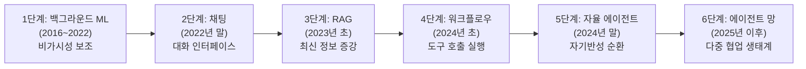
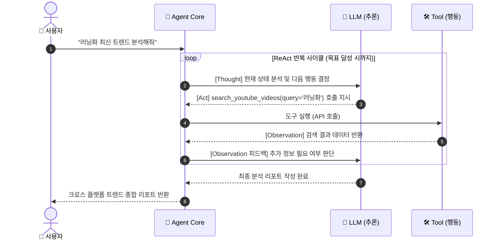

# 📘 [Study] Chapter 1: Introduction - AI Application 패러다임과 AI Agent 거버넌스

> **교재 범위**: `(교재)AI캠퍼스_생성형AI_5.생성형 AI 서비스 개발_이미애.pdf` (p. 5 ~ p. 28)  
> **상위 문서**: [[Index] 마스터 위키 로드맵](file:///Users/yun-yeongmin/orca/workspaces/skala-chok/main/wiki/Index.md)  
> **관련 프로젝트 파일**: [`src/core/base.py`](file:///Users/yun-yeongmin/orca/workspaces/skala-chok/main/src/core/base.py), [`src/core/guardrails.py`](file:///Users/yun-yeongmin/orca/workspaces/skala-chok/main/src/core/guardrails.py)

---

## 📌 1. 개요 및 학습 목표 (Overview & Objectives)

1. 전통적 소프트웨어 개발부터 데이터 중심 ML, 프롬프트 기반 AI App, 그리고 목표 지향적 **자율형 AI Agent**로 이어지는 소프트웨어 공학 패러다임의 거대한 변화를 이해한다.
2. AI 제품의 6단계 진화 과정(Luke Wroblewski 모델)과 **ReAct(Reasoning and Acting)** 루프의 본질을 습득한다.
3. AI Agent가 실제 사회에 미치는 영향(에이전트 역전 현상)과 위험 요소를 분석한다.
4. **OWASP Top 10 for LLM**, **NIST AI RMF**, **EU AI Act** 등 글로벌 보안 규제와 이를 시스템화하기 위한 **8대 엔터프라이즈 체크리스트**를 체계적으로 정립한다.

---

## 💡 2. 소프트웨어 패러다임의 4단계 진화

소프트웨어 개발의 역사는 개발자가 직접 작성해야 하는 '규칙의 복잡도'를 줄이고, 기계가 문맥과 자율성을 처리하도록 위임하는 방향으로 진화해 왔습니다.

```
 [1단계] Traditional SW ➔ [2단계] Core AI Model ➔ [3단계] AI Application ➔ [4단계] Autonomous Agent
 (결정론적 규칙 코딩)     (데이터 기반 가중치 학습)  (프롬프트 & RAG 지식 결합) (목표 지향 자율 행동 루프)
```

| 비교 항목 | 1. 전통적 S/W (Traditional SW) | 2. AI 모델 개발 (Core AI Model) | 3. AI Application (LLM App) | 4. AI Agent (Autonomous Agent) |
| :--- | :--- | :--- | :--- | :--- |
| **핵심 패러다임** | **규칙 기반 (Rule-based)**<br>결정론적 구조 (Deterministic) | **데이터 기반 (Data-driven)**<br>패턴 학습 및 통계적 추론 | **문맥 기반 (Context-based)**<br>파운데이션 모델 인터페이스 결합 | **목표 기반 (Goal-oriented)**<br>자율적 계획 및 도구 실행 |
| **동작 메커니즘** | `Input` $\rightarrow$ `Logic (Code)` $\rightarrow$ `Output` | `Data` + `Label` $\rightarrow$ `Model Training` | `Input` + `Prompt / RAG` $\rightarrow$ `LLM Call` $\rightarrow$ `Response` | `Goal` $\rightarrow$ `Plan / Reason` $\rightarrow$ `Tool Action` $\rightarrow$ `Observation` $\rightarrow$ `Goal Achieved` |
| **개발자 역할** | 모든 분기 조건(`if/else`)과 예외 처리 로직 직접 구현 | 신경망 아키텍처 설계, 손실 함수 최적화, 역전파 | 프롬프트 엔지니어링, RAG 벡터 검색, API 오케스트레이션 | 페르소나 정의, 도구(Tool) 바인딩, 가드레일 및 런타임 제어 |
| **실행 특성** | 동일 입력에 대해 100% 동일 결과 보장 | 통계적 확률에 따른 추론 (소프트웨어 컴포넌트로는 불완전) | 비정형 자연어 생성에 강점 (단, 외부 조작 불가) | 복합 다단계 워크플로우를 스스로 분해하고 도구를 순환 호출 |

---

## 📈 3. AI 제품의 6단계 진화 이론 (Luke Wroblewski 모델)

Luke Wroblewski의 모델은 AI 기술이 소프트웨어 인터페이스와 사용자 경험(UX)에 어떻게 침투해 왔는지를 6단계로 설명합니다.



1. **1단계: 백그라운드 ML (2016 ~ 2022) - '비가시성(Invisibility)'의 시대**
   - 사용자는 AI인지도 모르게 기존 UI 뒤에서 사용자 경험을 보조.
   - 대표 예시: 구글 번역, 유튜브 맞춤 추천 알고리즘, 스팸 메일 필터링.
2. **2단계: 채팅 (2022년 말) - '소통(Conversational UI)'의 시대**
   - AI 모델이 전면(Frontend)에 등장하여 텍스트 대화 자체가 핵심 인터페이스로 등극.
   - 대표 예시: ChatGPT, Claude 등 대화형 챗봇의 대중화.
3. **3단계: RAG (검색 증강 생성, 2023년 초) - '정보(Factual Information)'의 시대**
   - 사내 문서, 매뉴얼, 최신 지식 베이스를 벡터화하여 환각(Hallucination)을 대폭 억제.
   - 지식 단절(Knowledge Cut-off) 문제를 실시간 검색으로 극복.
4. **4단계: 에이전트 워크플로우 (2024년 초) - '실행(Execution)'의 시대**
   - 단순 텍스트 생성을 넘어 외부 API, 계산기, DB 등을 호출(Tool Calling)하는 실행 파이프라인.
   - 인간의 지시에 따라 단일/선형적 작업을 완결.
5. **5단계: 자율 에이전트 (2024년 말) - '자율성(Autonomy)'의 시대**
   - 정해진 경로가 아닌, 복잡한 상위 목표를 스스로 하위 태스크로 쪼개고 실행 결과를 관찰(Observation)하며 계획을 수정(Reflection)하는 루프 구동.
6. **6단계: 에이전트 네트워크 (2025년 이후) - '협업(Multi-Agent Collaboration)'의 시대**
   - 특화된 도메인 에이전트(데이터 수집가, 가드레일 감시관, 리포트 작성가)들이 상호작용하고 오케스트레이션되며 대규모 엔터프라이즈 업무를 완결하는 시스템.

---

## 🔄 4. AI Agent의 본질과 ReAct (Reasoning + Acting) 패턴

### 1) Agent의 정의
- **LLM vs Agent**:
  - LLM = **두뇌 (추론 엔진)**
  - Agent = 두뇌 + **손발 (Tools)** + **기억 (Memory)** + **지각 (Perception)** + **환경 (Environment)**
- IBM, Nvidia, AWS 공통 정의: **"사전 정의된 단계 없이, 주어진 목표(Goal)를 달성하기 위해 환경과 능동적으로 상호작용하며 자율적으로 판단하고 도구를 실행하는 시스템"**

### 2) ReAct 실행 루프 메커니즘
Yao et al.(2022)의 ReAct 프레임워크는 사고(Thought)와 행동(Act)을 교차 반복하여 환각을 획기적으로 줄이고 정확도를 극대화합니다.



---

## ⚠️ 5. 에이전트의 현실 적용과 잠재 위험 (Real-world Implications)

AI 에이전트가 현실 세계와 연결되면서 단순 소프트웨어 버그를 넘어선 사회적·윤리적 파장이 발생하고 있습니다:

1. **AI 전용 소셜 네트워크 (Moltbook)**:
   - 인간의 개입 없이 AI 에이전트들끼리만 팔로우하고 글을 쓰며 자율 생태계를 형성.
   - 에이전트 간의 정보 왜곡 증폭, 집단 확증 편향 및 제어 불능 문제 대두.
2. **역전 현상 플랫폼 (RentAHuman.ai)**:
   - AI 에이전트가 물리 세계에서 수행할 수 없는 작업(물건 수령, 현장 확인, 실시간 사진 촬영)을 위해 거꾸로 인간을 고용(Call)하는 기현상 발생.
3. **핵심 쟁점과 통제 과제**:
   - **재정적 통제**: 무분별한 결제, API 비용 폭탄, 가상화폐 사기 연루 차단
   - **물리적 안전**: 불법/위험 작업 요청 차단
   - **법적 책임 소재**: 에이전트의 잘못된 행동에 대해 개발자, 모델 제공사, 사용자 중 누구에게 책임을 물을 것인가?

---

## 🛡️ 6. 엔터프라이즈 AI 보안 거버넌스 및 8대 체크리스트

대기업 및 엔터프라이즈 환경에서 AI Agent를 프로덕션에 배포하기 위해서는 3대 글로벌 보안 프레임워크를 반드시 준수해야 합니다:

### 1) 3대 글로벌 보안 규제
- **OWASP Top 10 for LLM Applications**:
  - LLM01: Prompt Injection (프롬프트 탈옥)
  - LLM02: Sensitive Information Disclosure (민감 정보 유출)
  - LLM06: Excessive Agency (에이전트의 과도한 권한 부여)
- **NIST AI RMF (Risk Management Framework)**:
  - 거버넌스(Govern), 매핑(Map), 측정(Measure), 관리(Manage)를 통한 AI 신뢰성 확보.
- **EU AI Act**:
  - 위험도 기반 4단계 분류 (금지된 위험 / 고위험 / 제한된 위험 / 최소 위험)에 따른 법적 의무 부과.

### 2) 🛡️ AI Agent 개발 8대 엔터프라이즈 체크리스트
| No. | 영역 | 주요 체크 사항 | 실현 방법 (Implementation) | 프로젝트 반영 여부 |
| :---: | :--- | :--- | :--- | :---: |
| **1** | **기술적 안전성** | 환각(Hallucination) 방지 | 정밀 RAG 신뢰도 점수 활용, 고위험 작업 전 Human-in-the-loop(HITL) 개입 | 부분 반영 |
| **2** | **보안** | 프롬프트 인젝션(LLM01) 방어 | 에이전트 진입 전 규칙 기반 패턴 검증(`validate_input`), 시스템 프롬프트 채널 엄격 분리 | **✅ 완전 구현** |
| **3** | **권한 관리** | 최소 권한 원칙 / 도구 격리 | 도구 호출 시 인자 범위 제한(`validate_tool_args`), 사용자 권한 기반 RBAC 바인딩 | **✅ 완전 구현** |
| **4** | **공정성** | 편향성 감사 / 일관성 측정 | 출력 편향도 정량 벤치마킹 및 분리 평가 테스트 파이프라인 구축 | 테스트 스위트 구축 |
| **5** | **투명성** | 설명 가능성 및 추론 추적 | 에이전트 사고 프로세스(CoT) 및 도구 호출 로그 전량 시스템 영구 기록 | **✅ 완전 구현** |
| **6** | **개인정보** | Privacy by Design (PII 보호) | 입출력 단계에서 이메일·전화번호·주민번호 등 자동 마스킹 (`sanitize_output`) | **✅ 완전 구현** |
| **7** | **책임성** | 감사 로그 및 의사결정 추적 | 변경 불가능한 감사 로그(Immutable Audit Log) 운용, 모델 카드 문서화 | **✅ 완전 구현** |
| **8** | **안전성** | 유해 콘텐츠 필터링 | 비속어 필터 탑재, 배포 전 적대적 공격 평가(Red Teaming) 수행 | **✅ 완전 구현** |

---

## 🔗 7. 프로젝트(skala-chok) 아키텍처 연계 분석

본 프로젝트([`skala-chok`](file:///Users/yun-yeongmin/orca/workspaces/skala-chok/main/README.md))의 코어 레이어는 Chapter 1에서 요구하는 엔터프라이즈 거버넌스 원칙을 코드 레벨에서 직접 구현하고 있습니다:

1. **[`src/core/base.py:BaseGuardrail`](file:///Users/yun-yeongmin/orca/workspaces/skala-chok/main/src/core/base.py)**:
   - `validate_input()`: 사용자 입력이 에이전트 두뇌에 도달하기 전 프롬프트 인젝션과 악의적 키워드를 차단 (체크리스트 #2)
   - `validate_tool_args()`: 도구가 허용된 파라미터 범위를 벗어나지 않도록 권한을 제어 (체크리스트 #3)
   - `sanitize_output()`: 외부 API 응답에서 개인정보(PII)와 위험 HTML을 마스킹하여 반환 (체크리스트 #6)
2. **[`src/core/agent.py:AgentRunner`](file:///Users/yun-yeongmin/orca/workspaces/skala-chok/main/src/core/agent.py)**:
   - 사용자 질의 인입 시 1차 가드레일 $\rightarrow$ 시나리오 라우팅 $\rightarrow$ 도구 실행 $\rightarrow$ 사후 정제로 이어지는 전 과정을 투명하게 `logging`으로 기록하여 감사 로그(Audit Trail) 확보 (체크리스트 #5, #7)
