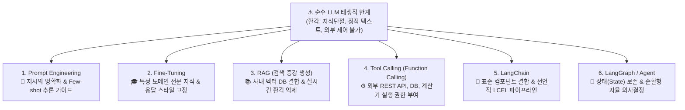

# 📘 [Study] Chapter 2: LLM과 친해지기 - 오픈소스·상용 파운데이션 모델 활용과 API 제어

> **교재 범위**: `(교재)AI캠퍼스_생성형AI_5.생성형 AI 서비스 개발_이미애.pdf` (p. 29 ~ p. 64)  
> **상위 문서**: [[Index] 마스터 위키 로드맵](file:///Users/yun-yeongmin/orca/workspaces/skala-chok/main/wiki/Index.md)  
> **관련 프로젝트 파일**: [`src/config.py`](file:///Users/yun-yeongmin/orca/workspaces/skala-chok/main/src/config.py), [`tests/modules/`](file:///Users/yun-yeongmin/orca/workspaces/skala-chok/main/tests/modules/)

---

## 📌 1. 개요 및 학습 목표 (Overview & Objectives)

1. 대규모 언어 모델(LLM)의 **다음 토큰 예측(Next Token Prediction)** 원리와 생성 하이퍼파라미터(`Temperature`, `top_p`, `top_k`)의 역할을 습득한다.
2. 순수 LLM이 갖는 태생적 한계(환각, 지식 단절, 외부 조작 불가)를 극복하기 위한 **6대 핵심 엔지니어링 기술 스택**을 이해한다.
3. OpenAI, Anthropic, Google, Meta 등 **글로벌 주요 파운데이션 모델(Foundation Models)**의 특징, 장단점, 라이선스 체계를 비교 분석한다.
4. **Hugging Face Transformers Pipeline**, **Google GenAI SDK**, **OpenAI SDK**의 핵심 API 사용법과 상태 관리 메커니즘을 마스터한다.

---

## 💡 2. LLM의 다음 토큰 예측 원리와 생성 제어

### 1) Next Token Prediction 원리
대규모 언어 모델은 질문에 대한 '정답'을 검색하는 시스템이 아닙니다.  
이전까지 주어진 입력 토큰 시퀀스($x_1, x_2, \dots, x_{t-1}$)가 주어졌을 때, 어휘집(Vocabulary) 내의 모든 단어 후보 중 **다음에 올 확률이 가장 높은 토큰($x_t$)을 통계적으로 샘플링(Sampling)**하는 자기회귀(Autoregressive) 확률 모델입니다.

$$P(x_t \mid x_1, x_2, \dots, x_{t-1}) = \text{Softmax}\left(\frac{z_t}{T}\right)$$

### 2) 생성 제어 3대 하이퍼파라미터
| 파라미터 | 정의 및 동작 방식 | 권장값 범위 | 활용 시나리오 |
| :--- | :--- | :---: | :--- |
| **Temperature ($T$)** | Softmax 로짓(Logit) 값을 나누어 확률 분포의 평탄도(Flatness)를 조절 | `0.0` ~ `2.0` | • `0.0 ~ 0.2`: 코드 생성, JSON 추출, 사실 기반 질의 (결정론적)<br>• `0.7 ~ 1.0`: 일반 대화, 창의적 글쓰기, 아이디어 브레인스토밍 |
| **Top-p (Nucleus)** | 누적 확률이 $p$에 도달할 때까지 상위 토큰들만 후보군으로 제한 | `0.1` ~ `1.0` | 엉뚱하거나 위험한 희귀 토큰을 꼬리(Tail)에서 원천 차단 (통상 0.9 권장) |
| **Top-k** | 확률이 가장 높은 상위 $k$개의 토큰만 후보군으로 고정 | `1` ~ `100` | 모델의 어휘 다양성을 물리적으로 제한할 때 사용 (Gemini 등에서 지원) |

> ⚠️ **Best Practice**: `Temperature`와 `Top-p`를 동시에 극단적으로 변경하면 예측 불가능한 출력이 발생하므로, 일반적으로 하나를 고정하고 다른 하나를 조절합니다.

---

## 🛠️ 3. LLM의 태생적 한계를 극복하는 6대 핵심 기술

순수 파운데이션 모델은 강력하지만 **환각(Hallucination), 최신 지식 단절(Knowledge Cut-off), 정적 텍스트 생성, 외부 시스템 조작 불가**라는 치명적인 한계를 지닙니다. 엔지니어는 이를 6단계 보완 기술로 극복합니다.



1. **Prompt Engineering (지시의 정밀화)**: Few-shot, Chain-of-Thought(CoT)를 적용하여 모델의 추론 경로를 유도.
2. **Fine-Tuning (도메인 특화 학습)**: 의료, 금융, 법률 등 고유한 도메인 어휘와 출력 형식을 모델 가중치에 직접 각인.
3. **RAG (최신 지식 검색 증강)**: 외부 문서를 청킹/임베딩하여 벡터 DB에 저장하고, 유사도가 높은 청크를 프롬프트에 실시간 주입.
4. **Tool Calling (행동력 부여)**: 모델에 함수 스키마(JSON Schema)를 바인딩하여 계산기, 검색 API, 결제 API를 실행하도록 요청 생성.
5. **LangChain (프레임워크 표준화)**: 모델, 프롬프트, 도구, 파서를 유닉스 파이프라인(`|`)으로 표준 연결.
6. **LangGraph / Agent (자율 제어)**: 상태(State) 기반 루프를 통해 에이전트가 결과를 스스로 검토하고 반성(Reflection)하며 다단계 업무를 완결.

---

## 🌐 4. 2025~2026 글로벌 파운데이션 모델 비교 분석

| 공급사 | 대표 모델 | 라이선스 | 컨텍스트 창 | 핵심 강점 및 특징 |
| :--- | :--- | :---: | :---: | :--- |
| **OpenAI** | GPT-4o, GPT-4o-mini, o1 | 독점 API | 128k 토큰 | • 업계 최고 수준의 범용 지능 및 안정적인 Tool Calling 생태계<br>• o1 시리즈의 심층 추론(Reinforcement Learning CoT) |
| **Anthropic** | Claude 3.5 Sonnet, 3 Opus | 독점 API | 200k 토큰 | • 코딩, 아키텍처 설계, 정교한 뉘앙스 분석 1위<br>• 헌법적 AI(Constitutional AI) 기반의 뛰어난 안전성 |
| **Google** | Gemini 1.5/2.5 Pro, Flash | 독점 API | **최대 200만 토큰** | • 텍스트·음성·영상·이미지 네이티브 멀티모달 처리<br>• 초대용량 컨텍스트 기반 책/영상 전체 분석 |
| **Meta** | Llama 3.1 / 3.2 (8B, 70B, 405B) | 오픈소스 | 128k 토큰 | • 상업적 무료 라이선스 제공, 가중치 완전 공개<br>• 프라이빗 클라우드/온프레미스 보안 구축의 표준 |
| **Mistral AI** | Mistral Large, Mixtral 8x22B | 하이브리드 | 128k 토큰 | • MoE(Mixture of Experts) 기반 초고속 추론 및 비용 효율성<br>• 유럽 내 데이터 주권(Data Sovereignty) 준수 |
| **Microsoft** | Phi-3 / Phi-4 | 오픈소스 | 128k 토큰 | • 고품질 합성 데이터 학습을 통한 소형언어모델(SLM) 최강자<br>• 엣지 디바이스 및 온디바이스 탑재 최적화 |

---

## 💻 5. 주요 SDK 실습 코드 및 상태 관리

### 1) Hugging Face Transformers Pipeline 실습
별도의 가중치 훈련 없이 사전 학습된 오픈소스 모델을 파이프라인 인터페이스로 즉시 구동합니다.

```python
from transformers import pipeline

# 1. 감정 분석 (Sentiment Analysis)
classifier = pipeline("sentiment-analysis", model="matthewburke/korean_sentiment")
results = classifier(["이 제품 정말 편리하고 배송도 빠르네요!", "설명서가 너무 부실해서 실망했습니다."])
# 결과: [{'label': 'LABEL_1', 'score': 0.98}, {'label': 'LABEL_0', 'score': 0.96}]

# 2. 질문 답변 (Extractive Question Answering)
qa_pipeline = pipeline("question-answering", model="distilbert-base-cased-distilled-squad")
context_doc = "LangChain was launched in October 2022 by Harrison Chase as an open source project."
ans = qa_pipeline(question="Who launched LangChain?", context=context_doc)
# 결과: {'score': 0.94, 'answer': 'Harrison Chase'}

# 3. 텍스트 생성 파라미터 제어
generator = pipeline("text-generation", model="gpt2")
output = generator("Artificial Intelligence is evolving", max_new_tokens=40, temperature=0.7)
```

---

### 2) Google GenAI (Gemini) SDK
`google-genai` 최신 SDK를 사용한 멀티모달 및 내장 세션 대화 방식입니다.

```python
from google import genai
from google.genai import types

client = genai.Client()

# 1. 단발성 생성 및 시스템 지침 주입
resp = client.models.generate_content(
    model="gemini-2.5-flash",
    contents="RESTful API의 핵심 원칙을 요약해줘.",
    config=types.GenerateContentConfig(
        system_instruction="너는 15년 차 시니어 백엔드 소프트웨어 아키텍트야.",
        temperature=0.2
    )
)
print(resp.text)

# 2. 자동 세션 관리 대화 (Chat Session)
chat = client.chats.create(model="gemini-2.5-flash")
chat.send_message("내가 가장 좋아하는 운동은 수영이야.")
followup = chat.send_message("내가 무슨 운동을 좋아한다고 했지?")
print(followup.text) # "수영을 가장 좋아하신다고 말씀하셨습니다!"
```

---

### 3) OpenAI SDK 및 상태 관리 비교
OpenAI API는 기본적으로 **무상태(Stateless)** 프로토콜이므로, 개발자가 이전 대화 목록(`messages` 리스트)을 직접 누적하여 서버에 전달해야 합니다.

```python
from openai import OpenAI

client = OpenAI()
conversation_history = [
    {"role": "system", "content": "당신은 IT 서비스 기술 지원 봇입니다."}
]

def ask_assistant(user_message: str) -> str:
    conversation_history.append({"role": "user", "content": user_message})
    response = client.chat.completions.create(
        model="gpt-4o-mini",
        messages=conversation_history,
        temperature=0.3,
    )
    answer = response.choices[0].message.content
    conversation_history.append({"role": "assistant", "content": answer})
    return answer

# 음성 합성 (TTS-1) 기능 실습
speech = client.audio.speech.create(
    model="tts-1",
    voice="alloy",
    input="에이전트 시스템이 정상적으로 초기화되었습니다."
)
with open("system_alert.mp3", "wb") as f:
    f.write(speech.content)
```

---

## 🛡️ 6. 엔터프라이즈 모범 사례 및 아키텍처 전략

1. **모델 티어링(Tiering)을 통한 비용 및 지연 시간 최적화**:
   - 의도 분류, 단순 요약, 정규식 검증: 초경량 고속 모델(`gpt-4o-mini`, `gemini-2.5-flash`, `Claude 3.5 Haiku`) 사용
   - 복합 시나리오 크로스 분석, 전략 리포트 생성: 플래그십 모델(`gpt-4o`, `Claude 3.5 Sonnet`) 사용
2. **Stateless vs Stateful 확장성**:
   - 세션 객체에 종속되지 않고 메시지 히스토리를 데이터베이스(Redis, PostgreSQL)에 보관하는 Stateless 아키텍처를 채택해야 서버 다중화(Auto-scaling)가 가능함.

---

## 🔗 7. 프로젝트(skala-chok) 아키텍처 연계 분석

- **[`src/config.py:Settings`](file:///Users/yun-yeongmin/orca/workspaces/skala-chok/main/src/config.py)**:
  - `MODEL_NAME`, `OPENAI_API_KEY` 등을 Pydantic `BaseSettings`로 일원화하여, 코드 수정 없이 환경변수만으로 모델과 공급자를 교체할 수 있도록 설계되었습니다.
- **[`tests/modules/`](file:///Users/yun-yeongmin/orca/workspaces/skala-chok/main/tests/modules/) 격리 테스트**:
  - Chapter 2의 가상 테스트 원칙에 따라 `unittest.mock`을 통해 외부 OpenAI/YouTube/Naver API 호출을 100% 모킹하여, 쿼터 소모 없이 4초 이내에 126개 테스트가 완결되도록 구축되었습니다.
