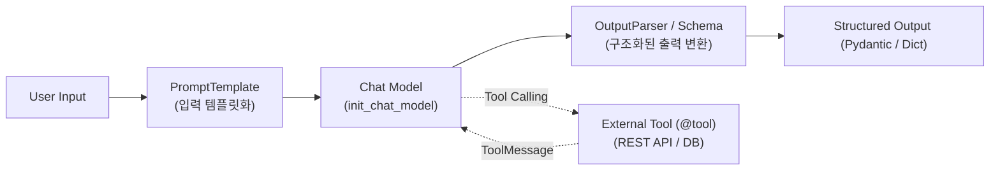

# 📘 [Study] Chapter 3: LangChain - 핵심 컴포넌트, LCEL 파이프라인 및 Tool Calling

> **교재 범위**: `(교재)AI캠퍼스_생성형AI_5.생성형 AI 서비스 개발_이미애.pdf` (p. 65 ~ p. 100)  
> **상위 문서**: [[Index] 마스터 위키 로드맵](Index.md)  
> **관련 프로젝트 파일**: [`src/core/router.py`](https://github.com/DevDAN09/skala-chok/blob/main/src/core/router.py), [`src/core/agent.py`](https://github.com/DevDAN09/skala-chok/blob/main/src/core/agent.py), [`src/modules/*/tools.py`](https://github.com/DevDAN09/skala-chok/blob/main/src/modules/naver_search/tools.py)

---

## 📌 1. 개요 및 학습 목표 (Overview & Objectives)

1. LangChain의 핵심 추상화 계층인 **Chat Models**, **Messages**, **Prompts**, **Output Parsers**의 역할을 이해한다.
2. 비정형 자연어 출력을 견고한 데이터 모델로 강제하는 **Pydantic 기반 Structured Outputs** 패턴을 습득한다.
3. 유닉스 파이프(`|`) 연산자를 활용한 선언적 파이프라인인 **LCEL (LangChain Expression Language)**과 고급 런너블(`RunnableParallel`, `RunnableBranch`)을 마스터한다.
4. LLM에 외부 세계 조작 권한을 부여하는 **Tool Calling(Function Calling)** 메커니즘과 **커스텀 도구(`@tool`) 작성 4대 원칙**을 체득한다.

---

## 💡 2. LangChain 4대 핵심 추상화 계층

LangChain은 서로 다른 벤더의 API 차이를 표준 인터페이스로 추상화하여, 레고 블록처럼 조립 가능한 개발 환경을 제공합니다.



### 1) Chat Models (`init_chat_model`)
- 통일된 팩토리 인터페이스인 `init_chat_model()`을 통해 벤더에 종속되지 않고 백엔드 모델을 유연하게 교체:
  ```python
  from langchain.chat_models import init_chat_model
  model = init_chat_model("gpt-4o-mini", model_provider="openai", temperature=0.0)
  ```
- **주요 제어 파라미터**:
  - `temperature`: 출력의 무작위성 조절 (0.0=결정론적, 1.0=창의적)
  - `max_tokens`: 생성 가능한 최대 토큰 길이
  - `timeout`: 원격 API 응답 대기 제한 시간 (타임아웃 방어)
  - `max_retries`: 네트워크 실패 시 자동 재시도 횟수

### 2) Messages 4대 계층
대화형 LLM은 단순 문자열이 아닌 **역할(Role)**이 부여된 메시지 객체들의 리스트를 입력으로 받습니다:
| 메시지 클래스 | 역할 (Role) | 주요 내용 및 특징 |
| :--- | :---: | :--- |
| **`SystemMessage`** | `system` | 모델의 페르소나, 제약 사항, 답변 규칙, 보안 가이드라인 정의 |
| **`HumanMessage`** | `user` | 최종 사용자가 입력한 자연어 질문 및 요청 |
| **`AIMessage`** | `assistant` | 모델이 생성한 텍스트 또는 도구 호출 요청(`tool_calls`) 메타데이터 |
| **`ToolMessage`** | `tool` | 도구가 실행된 후 반환된 원시 데이터 (반드시 `tool_call_id`와 1:1 매핑 필수) |

### 3) Prompts (`ChatPromptTemplate`, `MessagesPlaceholder`)
- **`ChatPromptTemplate.from_messages`**: 역할별 튜플 `("system", "지침")`, `("human", "{user_input}")`을 구조화하여 관리.
- **`MessagesPlaceholder`**: 고정된 텍스트 외에 동적으로 가변하는 대화 기록(Chat History)을 파이프라인에 주입할 때 사용.

### 4) Output Parsers & Pydantic Schema
- 단순 문자열을 파싱하는 `StrOutputParser`부터, JSON을 파싱하는 `JsonOutputParser`, 그리고 스키마 검증을 강제하는 `with_structured_output`으로 진화.

---

## 📐 3. Pydantic 기반 Structured Outputs (구조화된 출력)

엔터프라이즈 AI 애플리케이션에서 비정형 자연어 응답은 후속 비즈니스 로직(DB 적재, 슬랙 알림, 결제 연동)에서 파싱 에러를 유발합니다.  
LangChain은 `model.with_structured_output(PydanticModel)`을 통해 모델의 출력을 타입 안정성이 보장된 객체로 강제합니다.

```python
from pydantic import BaseModel, Field
from typing import List, Literal

class ScenarioRoutingDecision(BaseModel):
    """사용자의 질의를 분석하여 가장 적합한 시나리오와 파라미터를 추출합니다."""
    scenario_name: Literal["cross_platform_trend", "competitor_analysis", "none"] = Field(
        description="매칭된 시나리오 고유 식별자. 적합한 시나리오가 없으면 'none'."
    )
    confidence: float = Field(
        description="해당 시나리오 매칭에 대한 확신도 (0.0 ~ 1.0)", ge=0.0, le=1.0
    )
    extracted_parameters: dict = Field(
        description="시나리오 실행에 필요한 필수 파라미터 딕셔너리"
    )

# 모델에 스키마 바인딩
structured_llm = model.with_structured_output(ScenarioRoutingDecision)
decision = structured_llm.invoke("러닝화 최신 트렌드 분석해줘")
print(decision.scenario_name) # "cross_platform_trend"
print(decision.confidence)    # 0.95
```

---

## ⚡ 4. LCEL (LangChain Expression Language) & 고급 Runnable

LCEL은 유닉스 파이프(`|`) 문법을 차용하여 복잡한 체인을 직관적이고 선언적으로 기술합니다.

```python
chain = prompt | model | parser
```

### 1) LCEL 4대 고급 런너블 컴포넌트
| 컴포넌트 | 핵심 기능 | 대표 활용 시나리오 |
| :--- | :--- | :--- |
| **`RunnablePassthrough`** | 입력을 변형 없이 그대로 다음 단계로 전달 | 원본 질문(`question`)을 보존하면서 추가 검색 결과를 딕셔너리로 묶을 때 |
| **`RunnableParallel`** | 동일한 입력을 받아 여러 서브 체인을 **동시에 병렬 실행** 후 결합 | 동일 키워드에 대해 네이버 트렌드와 유튜브 검색을 동시 수집할 때 |
| **`RunnableLambda`** | 임의의 파이썬 함수를 체인 요소로 변환 | 데이터 전처리, HTML 태그 정제, 비즈니스 계산 함수 삽입 |
| **`RunnableBranch`** | 조건 분기(if-else)를 수행하여 입력에 맞는 전용 체인으로 라우팅 | 질문의 카테고리(쇼핑/미디어/일반) 분류에 따른 전담 체인 분기 |

### 2) RunnableParallel & RunnableBranch 실습 예제
```python
from langchain_core.prompts import ChatPromptTemplate
from langchain_core.output_parsers import StrOutputParser
from langchain_core.runnables import RunnableParallel, RunnablePassthrough, RunnableBranch

# 1. RunnableParallel: 복수 관점 동시 분석
pos_prompt = ChatPromptTemplate.from_template("'{topic}'의 장점을 1줄로 요약:\n")
neg_prompt = ChatPromptTemplate.from_template("'{topic}'의 위험성을 1줄로 요약:\n")

parallel_analyzer = RunnableParallel(
    topic=RunnablePassthrough(),
    pros=(pos_prompt | model | StrOutputParser()),
    cons=(neg_prompt | model | StrOutputParser()),
)
analysis_result = parallel_analyzer.invoke("원격 근무 활성화")
print(analysis_result)

# 2. RunnableBranch: 조건부 동적 라우팅
classifier = ChatPromptTemplate.from_template(
    "다음 질의가 유튜브 관련이면 'YT', 네이버 관련이면 'NAVER', 그 외면 'ETC'를 출력:\n{query}"
) | model | StrOutputParser()

yt_branch = ChatPromptTemplate.from_template("유튜브 전문가로서 답변: {query}") | model | StrOutputParser()
naver_branch = ChatPromptTemplate.from_template("네이버 플랫폼 전문가로서 답변: {query}") | model | StrOutputParser()
default_branch = ChatPromptTemplate.from_template("일반 AI 비서로서 답변: {query}") | model | StrOutputParser()

router_chain = RunnableBranch(
    (lambda x: "YT" in classifier.invoke({"query": x["query"]}), yt_branch),
    (lambda x: "NAVER" in classifier.invoke({"query": x["query"]}), naver_branch),
    default_branch
)
```

---

## 🛠️ 5. 커스텀 도구(`@tool`) 작성 4대 원칙 및 Tool Calling

LLM은 파이썬 함수 내부의 소스 코드를 읽을 수 없습니다. 오직 함수의 **이름(Name)**, **인자 타입(Type Hint)**, 그리고 **설명문(Docstring)**만을 읽고 호출 여부를 결정합니다.

```
┌────────────────────────────────────────────────────────┐
│ 🎯 커스텀 도구 개발 4대 수칙                           │
│ 1. 명확하고 직관적인 함수명 부여                        │
│ 2. 모든 인자와 반환형에 대한 정밀한 Type Hinting        │
│ 3. LLM이 '언제, 왜 호출해야 하는지' 명시한 Docstring    │
│ 4. LangChain 표준 @tool 데코레이터 적용                 │
└────────────────────────────────────────────────────────┘
```

```python
from langchain.tools import tool

@tool
def calculate_growth_rate(current_value: float, previous_value: float) -> str:
    """이전 값 대비 현재 값의 성장률(%)을 정확히 계산하는 도구입니다.

    Args:
        current_value (float): 현재 시점의 수치 (예: 올해 매출, 최신 조회수).
        previous_value (float): 직전 시점의 기준 수치. 0보다 커야 합니다.

    Returns:
        str: 계산된 성장률 퍼센트 문자열 (실패 시 에러 설명).
    """
    if previous_value <= 0:
        return "기준 값(previous_value)은 0보다 커야 합니다."
    rate = ((current_value - previous_value) / previous_value) * 100
    return f"성장률: {rate:.2f}%"

# 모델에 도구 바인딩
model_with_tools = model.bind_tools([calculate_growth_rate])
ai_msg = model_with_tools.invoke("작년 조회수 10,000회에서 올해 15,000회로 늘었어. 성장률 계산해줘.")
print(ai_msg.tool_calls)
# [{'name': 'calculate_growth_rate', 'args': {'current_value': 15000.0, 'previous_value': 10000.0}}]
```

---

## 🔗 6. 프로젝트(skala-chok) 아키텍처 연계 분석

- **[`src/core/router.py:ScenarioRouter`](https://github.com/DevDAN09/skala-chok/blob/main/src/core/router.py)**:
  - 교재 3장의 `with_structured_output` 및 LCEL 파이프라인(`chain = prompt | structured_llm`)을 그대로 적용하여, 사용자 질의로부터 시나리오명과 파라미터를 JSON으로 완벽하게 파싱합니다.
- **[`src/modules/*/tools.py`](https://github.com/DevDAN09/skala-chok/blob/main/src/modules/naver_search/tools.py)**:
  - 4개 모듈의 모든 도구(`search_naver_blog`, `search_youtube_videos` 등)가 4대 수칙(Docstring, Type Hint, `@tool`)을 100% 준수하여 구현되어 있습니다.
- **[`src/core/registry.py:ModuleRegistry`](https://github.com/DevDAN09/skala-chok/blob/main/src/core/registry.py)**:
  - 개별 도메인 워커들이 분리된 파일에서 작성한 `@tool`들을 동적으로 수집하여 중앙 에이전트의 `model.bind_tools()`에 주입하는 플러그인 아키텍처를 완성했습니다.
