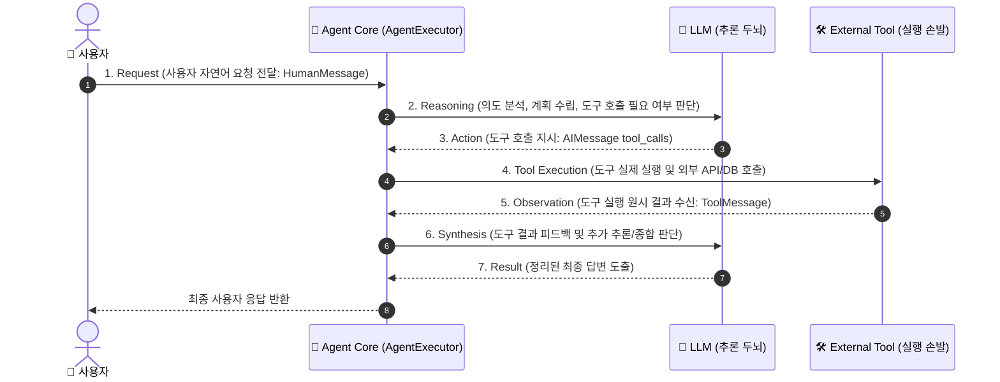
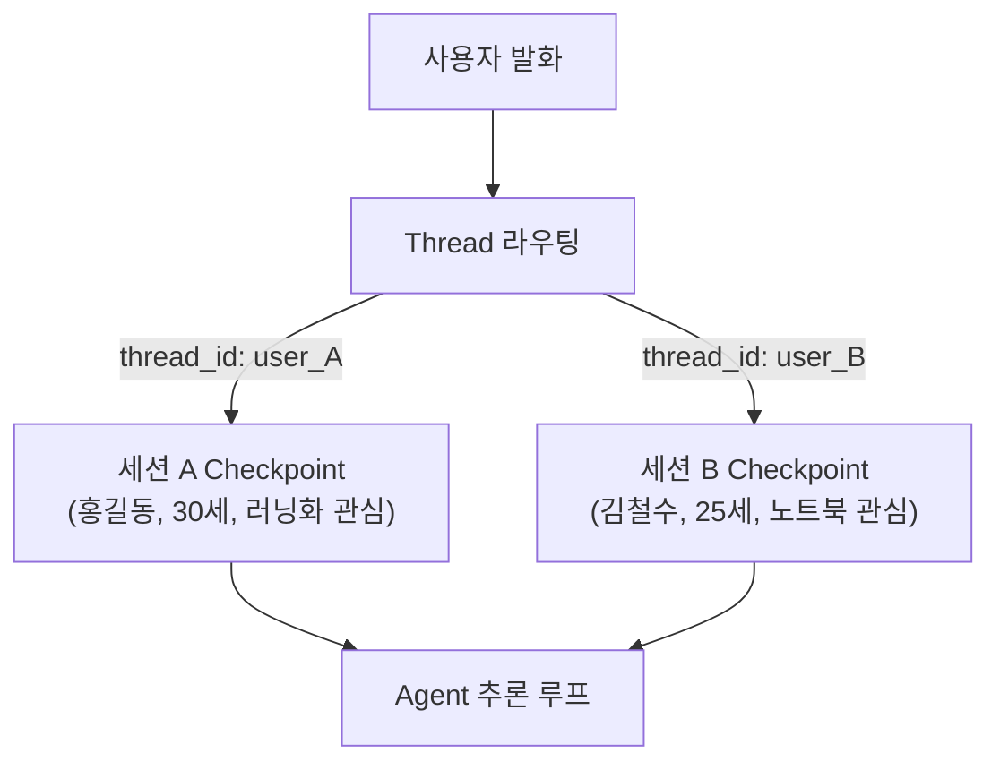

# 📘 [Study] Chapter 4: Basic Agent - 도구 바인딩, 단기 메모리(Checkpointer)와 구조화된 출력

> **교재 범위**: `(교재)AI캠퍼스_생성형AI_5.생성형 AI 서비스 개발_이미애.pdf` (p. 101 ~ p. 132)  
> **상위 문서**: [[Index] 마스터 위키 로드맵](Index.md)  
> **관련 프로젝트 파일**: [`src/core/agent.py`](https://github.com/DevDAN09/skala-chok/blob/main/src/core/agent.py), [`tests/core/test_agent.py`](https://github.com/DevDAN09/skala-chok/blob/main/tests/core/test_agent.py)

---

## 📌 1. 개요 및 학습 목표 (Overview & Objectives)

1. 언어 모델(Model)을 두뇌로 삼고 도구(Tools)를 손발로 삼아 상호작용하는 **Agent의 7단계 순환 라이프사이클**을 마스터한다.
2. 대화 세션의 독립성을 보장하고 이전 문맥을 유지하기 위한 **단기 메모리(Checkpointer)와 `thread_id`** 아키텍처를 이해한다.
3. 엔터프라이즈 자동화 파이프라인 연계를 위한 **`ToolStrategy` 기반 구조화 응답** 패턴을 습득한다.
4. 외부 API의 의존성 없이 개발 및 테스트를 가속하는 **`LLMToolEmulator` 및 Mocking 철학**을 학습한다.

---

## 🔄 2. Agent 7단계 실행 라이프사이클 (Agent Flow)

Agent는 목표가 달성될 때까지 두뇌(Model)의 추론과 손발(Tools)의 행동이 교차하며 순환 루프를 구동합니다.



### 단계별 상세 메커니즘
1. **Request (요청 접수)**: 사용자의 질의가 `HumanMessage` 형태로 전달됩니다.
2. **Reasoning (추론)**: 시스템 프롬프트와 도구 목록을 전달받은 모델이 사용자의 요청을 해결할 수 있는지 내부 지식을 점검합니다.
3. **Action (행동 지시)**: 모델이 자체 지식으로 불충분하다고 판단하면, 어떤 도구를 어떤 파라미터로 호출할지 결정(`tool_calls`)합니다.
4. **Tool Execution (도구 실행)**: 에이전트 코어가 지시된 도구를 실행하고 파라미터를 넘겨 실제 데이터를 수집합니다.
5. **Observation (관찰/수집)**: 도구의 반환 결과가 `ToolMessage` 객체에 담겨 에이전트로 반환됩니다.
6. **Synthesis (종합 추론)**: 에이전트는 도구 결과(`ToolMessage`)를 다시 모델에 전달하여 "이 정보로 충분한가, 아니면 추가 도구를 호출해야 하는가?"를 묻습니다.
7. **Result (최종 완결)**: 추가 도구가 필요 없으면 모델이 수집된 다각도 데이터를 종합하여 사용자 친화적인 최종 응답을 완성합니다.

---

## 🧠 3. 단기 메모리 (Short-term Memory) 아키텍처

대화형 에이전트는 HTTP처럼 기본적으로 무상태(Stateless)입니다. 사용자와의 연속적인 대화를 이어나가려면 상태를 영속화하는 단기 메모리가 필수적입니다.

### 1) Checkpointer와 `thread_id`
- **Checkpointer (`InMemorySaver`)**: 대화의 매 턴(Turn)마다 상태(State Snapshot)를 저장하고 복원하는 엔진.
- **`thread_id` (세션 식별자)**: 서로 다른 사용자 또는 독립된 대화 세션을 분리하는 고유 키.



### 2) 세션 격리 실습 코드
```python
from langchain.chat_models import init_chat_model
from langchain.tools import tool
from langchain.agents import create_agent
from langgraph.checkpoint.memory import InMemorySaver

model = init_chat_model("gpt-4o-mini", model_provider="openai")

@tool
def get_user_role(emp_id: str) -> str:
    """사원 번호를 기반으로 직책과 부서를 조회합니다."""
    return f"사번 {emp_id}: AI 플랫폼팀 수석 연구원"

agent = create_agent(
    model=model,
    tools=[get_user_role],
    checkpointer=InMemorySaver()
)

# 세션 1: thread_id = "session_alice"
config_alice = {"configurable": {"thread_id": "session_alice"}}
agent.invoke({"messages": [{"role": "user", "content": "내 사번은 EMP-1004야."}]}, config_alice)

resp1 = agent.invoke({"messages": [{"role": "user", "content": "내 직무가 뭐라고 했지?"}]}, config_alice)
print(resp1["messages"][-1].content)
# "사번 EMP-1004는 AI 플랫폼팀 수석 연구원입니다." (정상 기억)

# 세션 2: thread_id = "session_bob" (완전 격리)
config_bob = {"configurable": {"thread_id": "session_bob"}}
resp2 = agent.invoke({"messages": [{"role": "user", "content": "내 직무가 뭐라고 했지?"}]}, config_bob)
print(resp2["messages"][-1].content)
# "사번이나 직무에 대해 말씀해 주신 적이 없습니다." (세션 격리 성공)
```

---

## 📦 4. 구조화된 답변 (`ToolStrategy`) 및 가상 에뮬레이터

### 1) 비즈니스 파이프라인 연계를 위한 `ToolStrategy`
에이전트의 산출물이 비정형 텍스트이면 사내 ERP나 데이터베이스에 자동 적재할 수 없습니다.  
`ToolStrategy(PydanticModel)`를 적용하면 최종 답변을 엄격한 스키마 객체로 추출합니다.

```python
from pydantic import BaseModel, Field
from typing import Literal
from langchain.agents.structured_output import ToolStrategy

class SecurityAuditReport(BaseModel):
    severity: Literal["CRITICAL", "HIGH", "MEDIUM", "LOW"] = Field(description="보안 위협 수준")
    attack_type: str = Field(description="감지된 공격 유형")
    affected_endpoint: str = Field(description="영향을 받은 API 엔드포인트")
    mitigation_step: str = Field(description="긴급 조치 권장사항")

# response_format에 Pydantic ToolStrategy 바인딩
agent_security = create_agent(
    model=model,
    tools=[get_user_role],
    response_format=ToolStrategy(SecurityAuditReport)
)
```

### 2) `LLMToolEmulator` 가상 모킹 철학
외부 유료 API의 쿼터를 절약하고 네트워크 불안정 상태에서도 테스트를 완결하기 위해, 도구의 명세(Docstring)를 바탕으로 LLM이 현실적인 응답을 합성하는 에뮬레이터를 사용합니다.

---

## 🔗 5. 프로젝트(skala-chok) 아키텍처 연계 및 향후 개선 과제

### 1) 본 프로젝트의 구현 반영 사항
- **[`src/core/agent.py:AgentRunner`](https://github.com/DevDAN09/skala-chok/blob/main/src/core/agent.py)**:
  - Agent 7단계 라이프사이클을 완벽하게 수용하여 도구 호출 루프와 최종 답변 생성을 분리 로깅하도록 구현되었습니다.
- **[`tests/modules/`](https://github.com/DevDAN09/skala-chok/tree/main/tests/modules/) 100% Mocking 테스트 스위트**:
  - 교재 4장의 에뮬레이터/모킹 철학을 극대화하여 외부 API 호출 없이 126개의 모든 테스트를 4초 이내에 통과하도록 설계되었습니다.

### 2) 향후 권장 개선 과제 (P1 로드맵)
- **단기 메모리(대화 세션) 연결**:
  - 현재 `src/core/agent.py` 프롬프트에 `MessagesPlaceholder(variable_name="chat_history")`가 선언되어 있으나, CLI 실행 시 단발성 `{"input": query}`만 호출되고 있습니다.
  - 대화형 모드(`--interactive`)에서 `InMemorySaver` Checkpointer 또는 세션별 `chat_history` 메시지 리스트를 전달하여 멀티턴 문맥을 기억하도록 고도화가 필요합니다.
