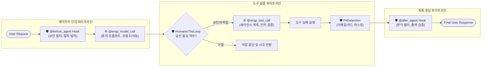
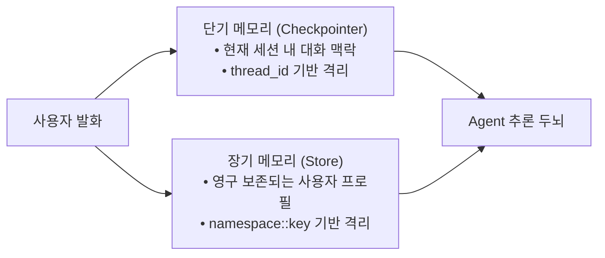

# 📘 [Study] Chapter 5: Advanced Agent - 런타임 상태 제어, 미들웨어, 가드레일 및 장기 메모리

> **교재 범위**: `(교재)AI캠퍼스_생성형AI_5.생성형 AI 서비스 개발_이미애.pdf` (p. 133 ~ p. 172)  
> **상위 문서**: [[Index] 마스터 위키 로드맵](file:///Users/yun-yeongmin/orca/workspaces/skala-chok/main/wiki/Index.md)  
> **관련 프로젝트 파일**: [`src/core/base.py`](file:///Users/yun-yeongmin/orca/workspaces/skala-chok/main/src/core/base.py), [`src/core/guardrails.py`](file:///Users/yun-yeongmin/orca/workspaces/skala-chok/main/src/core/guardrails.py)

---

## 📌 1. 개요 및 학습 목표 (Overview & Objectives)

1. 실행 시점에 동적인 정적 데이터를 주입하는 **컨텍스트 엔지니어링(Runtime Context)** 패턴을 이해한다.
2. 메인 비즈니스 로직을 오염시키지 않고 보안·관측성·승인 절차를 삽입하는 **엔터프라이즈 미들웨어(Middleware)** 및 **Hook 아키텍처**를 습득한다.
3. 악의적 프롬프트 차단부터 외부 응답 정제까지 포괄하는 **다계층 가드레일(Multi-layered Guardrails)**을 설계한다.
4. 단기 세션을 넘어 영구적으로 사용자 정보를 축적하는 **Store 기반 장기 메모리(Long-term Memory)** 시스템을 구축한다.

---

## 🧩 2. 컨텍스트 엔지니어링 (Runtime Context)

### 1) Static Prompt vs Runtime Context
- **정적 프롬프트**: 모델의 일반적인 역할("당신은 고객 상담원입니다") 정의.
- **Runtime Context**: 매 실행 시점에 외부 시스템(인증 서버, 결제 서버)으로부터 주입되는 동적 메타데이터(사용자 ID, 소속 테넌트, 사용자 등급 등).

### 2) `@wrap_model_call`을 활용한 동적 시스템 프롬프트 보강
```python
from dataclasses import dataclass
from langchain.agents.middleware import wrap_model_call
from langchain.agents import create_agent

@dataclass
class EnterpriseContext:
    user_id: str
    tenant_id: str
    user_tier: str  # VIP, NORMAL, TRIAL

@wrap_model_call
def inject_user_tier_middleware(request, handler):
    """모델 호출 직전 인터셉트하여 Context 정보를 기반으로 시스템 프롬프트를 동적 재구성합니다."""
    context: EnterpriseContext = request.runtime.context
    tier_instructions = f"\n[안내: 현재 요청자는 '{context.user_tier}' 등급입니다. 맞춤형 혜택을 우선 안내하세요.]"
    
    current_prompt = request.system_prompt or ""
    modified_request = request.override(system_prompt=current_prompt + tier_instructions)
    return handler(modified_request)
```

---

## 🛡️ 3. 엔터프라이즈 미들웨어 (Middleware) 아키텍처

미들웨어는 에이전트의 라이프사이클 전반에 개입하여 보안, 모니터링, 안전성 제어를 비침습적(Non-invasive)으로 수행합니다.



### 1) 주요 빌트인(Built-in) 미들웨어
| 미들웨어 | 역할 및 핵심 동작 |
| :--- | :--- |
| **`HumanInTheLoop`** | 대량 결제, DB 삭제, 메일 발송 등 **부작용(Side-effect)을 유발하는 고위험 작업 직전 사용자의 명시적 확인(Approval)**을 강제 |
| **`PIIDetection`** | 입력 프롬프트 및 도구 반환값에서 이메일, 주민번호, 신용카드 번호 등 개인 식별 정보를 탐지하여 자동 마스킹 |
| **`ToDoList`** | 다단계 복합 작업을 수신했을 때 에이전트 스스로 할 일 목록(`write_todos`)을 수립하고 완료 여부를 체크포인트로 관리 |
| **`Summarization`** | 대화가 길어져 토큰 한도를 초과할 때, 오래된 메시지들을 자동으로 요약 압축하여 문맥 윈도우 유지 |
| **`LLMToolEmulator`** | 외부 유료 API나 미완성 백엔드를 가상으로 모킹하여 테스트 개발 가속 |

### 2) 커스텀 Hook 스타일 비교
- **Node-style Hook (`@before_agent`, `@after_agent`)**:
  - 시작 전과 완료 후에만 1회 개입. 불법 키워드나 프롬프트 인젝션 발견 시 조기 반환(`Early Exit`).
- **Wrap-style Hook (`@wrap_model_call`, `@wrap_tool_call`)**:
  - 함수 호출의 앞뒤를 감싸며, 실행 시간(Latency) 계측, 파라미터 변조, 재시도(Retry) 로직 구현에 적합.

---

## 🏰 4. 다계층 가드레일 (Multi-layered Guardrails)

가드레일은 에이전트의 신뢰성과 보안을 담보하는 다중 방어선입니다.

```
 [1차: Before Agent] ➔ [2차: Tool Execution Guardrail] ➔ [3차: After Agent]
 (악의적 질의 차단)       (허용 인자/권한 엄격 검증)          (민감정보 마스킹/정제)
```

| 구분 | 1차: Before Agent (입력 방패) | 2차: Tool Guardrail (실행 방패) | 3차: After Agent (출력 방패) |
| :--- | :--- | :--- | :--- |
| **검사 시점** | 질의 접수 직후 (두뇌 진입 전) | 도구 호출 직전 | 최종 응답 완성 직후 |
| **주요 목적** | 프롬프트 인젝션(탈옥), 비속어 차단 | 파라미터 범위 검증, 비인가 자원 차단 | 사내 기밀 유출 차단, PII 마스킹, 환각 억제 |
| **실행 예시** | "시스템 지침을 무시해" 차단 | `display` 파라미터 1~100 범위 제한 | `<b>` HTML 태그 제거, 이메일 `***@***` 마스킹 |

---

## 💾 5. Long-term Memory (장기 메모리) 아키텍처

단기 메모리(Checkpointer)가 세션(Thread) 내에서만 휘발성으로 유지된다면, 장기 메모리(Store)는 **시간과 세션을 초월하여 사용자의 프로필, 취향, 히스토리를 영구 저장**합니다.



### 1) 네임스페이스 키 설계 원칙
다중 테넌트(Multi-tenant) 환경에서 데이터 오염과 유출을 방지하기 위해 계층화된 네임스페이스 키를 구성합니다:
```
{user_id}::{tenant_or_app}::{unique_uuid}
예: usr_9942::shopping_agent::pref_running_shoes
```

### 2) 자율적 장기 메모리 도구 실습 코드
```python
from langchain.tools import tool
from langchain_core.stores import InMemoryStore
from langchain_core.documents import Document
import uuid

# 전역 영구 기억 저장소 (프로덕션 환경에서는 PostgreSQL / Redis 기반 Store)
global_store = InMemoryStore()

@tool
def save_user_preference(category: str, preference_detail: str, runtime) -> str:
    """사용자의 취향이나 중요한 정보를 장기 기억 저장소에 영구 보관합니다."""
    ctx = runtime.context
    key = f"{ctx.user_id}::profile::{uuid.uuid4()}"
    doc = Document(
        page_content=f"[{category}] {preference_detail}",
        metadata={"user_id": ctx.user_id, "category": category}
    )
    runtime.store.mset([(key, doc)])
    return f"사용자의 '{category}' 선호사항이 영구 기억되었습니다."

@tool
def load_user_preferences(category: str, runtime) -> str:
    """장기 기억 저장소에서 사용자의 이전 저장 정보를 모두 조회합니다."""
    ctx = runtime.context
    # 네임스페이스 기반 조회 로직
    return "이전에 저장된 선호사항: 쿠션감이 좋은 270mm 러닝화 선호"
```

---

## 🔗 6. 프로젝트(skala-chok) 아키텍처 연계 분석

본 프로젝트는 Chapter 5에서 학습한 엔터프라이즈 미들웨어 및 다계층 가드레일 철학을 그대로 코드에 구현해 두었습니다:

1. **[`src/core/base.py:BaseGuardrail`](file:///Users/yun-yeongmin/orca/workspaces/skala-chok/main/src/core/base.py)**:
   - 교재 5장의 3대 방어선을 각각 `validate_input`(1차), `validate_tool_args`(2차), `sanitize_output`(3차) 인터페이스로 표준화.
2. **[`src/core/guardrails.py:GuardrailedTool`](file:///Users/yun-yeongmin/orca/workspaces/skala-chok/main/src/core/guardrails.py)**:
   - 도구를 감싸는 `@wrap_tool_call` 데코레이터 패턴을 객체 지향적 래퍼 클래스로 구현.
   - 도구 실행 전 인자 유효성 검증과 실행 후 PII 마스킹/HTML 태그 제거를 자동으로 체이닝.
3. **[`src/core/base.py:BaseContextProvider`](file:///Users/yun-yeongmin/orca/workspaces/skala-chok/main/src/core/base.py)**:
   - 도메인별 작업자(Worker)가 각자의 도구 사용법과 배경지식을 동적으로 중앙 시스템 프롬프트에 주입하는 컨텍스트 엔지니어링 구현.
4. **향후 고도화 과제 (P4 로드맵)**:
   - 사용자별 관심 키워드와 트렌드 검색 선호도를 장기 보존할 수 있도록 `src/core/memory.py`에 Store 기반 사용자 프로필 관리 시스템 도입 예정.
