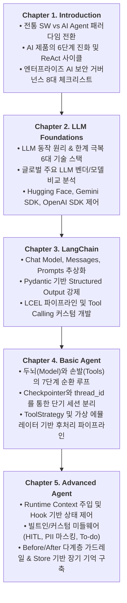

# 📚 [Home] 생성형 AI 서비스 개발 교재 마스터 위키 & 아키텍처 로드맵

> **교재**: `(교재)AI캠퍼스_생성형AI_5.생성형 AI 서비스 개발_이미애.pdf` (총 172페이지)  
> **시스템**: LangChain Multi-Worker & Model-Driven Scenario Agent (`skala-chok`)  
> **최근 업데이트**: 2026-09-11

본 위키는 생성형 AI 서비스 개발 교재의 전 챕터(Chapter 1 ~ Chapter 5)에서 다루는 이론, 엔터프라이즈 아키텍처 패턴, 실습 코드, 그리고 본 프로젝트([`skala-chok`](https://github.com/DevDAN09/skala-chok/blob/main/README.md)) 소스 코드와의 심층 매핑 내역을 집대성한 공식 기술 저장소입니다.

---

## 🧭 위키 챕터별 네비게이션 및 학습 로드맵

| 챕터 | 위키 문서 링크 | 핵심 토픽 | 주요 실습 및 컴포넌트 | 프로젝트 연계 파일 |
| :---: | :--- | :--- | :--- | :--- |
| **Ch.1** | [**Chapter 1. Introduction**](Chapter_1_Introduction.md) | AI App 패러다임 전환, 6단계 진화, ReAct 루프, AI 거버넌스 | OWASP Top 10, NIST AI RMF, EU AI Act, 8대 체크리스트 | [`src/core/base.py`](https://github.com/DevDAN09/skala-chok/blob/main/src/core/base.py) |
| **Ch.2** | [**Chapter 2. LLM Foundations**](Chapter_2_LLM_Foundations.md) | 토큰 예측 원리, 6대 보완 기술, 글로벌 파운데이션 모델 비교 | Hugging Face Pipeline, Google GenAI SDK, OpenAI SDK | [`src/config.py`](https://github.com/DevDAN09/skala-chok/blob/main/src/config.py) |
| **Ch.3** | [**Chapter 3. LangChain**](Chapter_3_LangChain.md) | LangChain 4대 추상화, Structured Output, LCEL 체이닝 | `init_chat_model`, Pydantic Schema, `RunnableParallel`, `@tool` | [`src/core/router.py`](https://github.com/DevDAN09/skala-chok/blob/main/src/core/router.py), [`tools.py`](https://github.com/DevDAN09/skala-chok/blob/main/src/modules/naver_search/tools.py) |
| **Ch.4** | [**Chapter 4. Basic Agent**](Chapter_4_Basic_Agent.md) | Agent 7단계 라이프사이클, 도구 오케스트레이션, 단기 메모리 | `create_agent`, `InMemorySaver`(`thread_id`), `LLMToolEmulator` | [`src/core/agent.py`](https://github.com/DevDAN09/skala-chok/blob/main/src/core/agent.py), [`tests/`](https://github.com/DevDAN09/skala-chok/tree/main/tests/) |
| **Ch.5** | [**Chapter 5. Advanced Agent**](Chapter_5_Advanced_Agent.md) | 런타임 상태 제어, 미들웨어, 다계층 가드레일, 장기 기억 | Runtime `Context`, Node/Wrap Hooks, HITL, `PIIDetection`, `Store` | [`src/core/guardrails.py`](https://github.com/DevDAN09/skala-chok/blob/main/src/core/guardrails.py), [`src/core/base.py`](https://github.com/DevDAN09/skala-chok/blob/main/src/core/base.py) |
| **부록** | [**Appendix. Observability**](Appendix_Observability_Troubleshooting.md) | 관측성 강화 및 로깅 6대 이슈 트러블슈팅 | 듀얼 경로 계측, 출력 정제 감사 로그, 라우팅 지연 계측 | [`src/main.py`](https://github.com/DevDAN09/skala-chok/blob/main/src/main.py), [`agent.py`](https://github.com/DevDAN09/skala-chok/blob/main/src/core/agent.py) |

---

## 🗺️ 전체 학습 여정 다이어그램 (Learning Flow)

---

## 🏛️ 교재 핵심 아키텍처 반영 현황 및 로드맵 점검표

본 프로젝트(`skala-chok`)가 교재의 5개 챕터 핵심 아키텍처를 어느 수준까지 반영하고 있는지 점검한 종합 현황표입니다.

### 1. 현황 점검 요약
- **반영 완료 (Implemented)**: 12개 항목 (전체 핵심 아키텍처의 약 75% 완성)
- **개선 필요 / 고도화 대상 (Action Items)**: 5개 항목 (단기 메모리 연결, 멀티 벤더 전환, 병렬 체이닝, 장기 메모리 스토어, HITL)

| 챕터 | 주요 아키텍처 항목 | 반영 여부 | 관련 소스 코드 |
| :---: | :---| :---: | :---|
| **Ch.1** | ReAct 추론-행동 실행 루프 | ✅ 반영 | [`src/core/agent.py`](https://github.com/DevDAN09/skala-chok/blob/main/src/core/agent.py) |
| **Ch.1** | 8대 거버넌스 체크리스트 (프롬프트 인젝션 방어, PII 마스킹) | ✅ 반영 | [`src/core/guardrails.py`](https://github.com/DevDAN09/skala-chok/blob/main/src/core/guardrails.py) |
| **Ch.2** | 환경변수 기반 모델 설정 및 하이퍼파라미터 추상화 | ✅ 반영 | [`src/config.py`](https://github.com/DevDAN09/skala-chok/blob/main/src/config.py) |
| **Ch.2** | 100% Mock 격리 테스트 환경 (쿼터 소모 0) | ✅ 반영 | [`tests/modules/`](https://github.com/DevDAN09/skala-chok/tree/main/tests/modules/), [`tests/core/`](https://github.com/DevDAN09/skala-chok/tree/main/tests/core/) |
| **Ch.3** | Messages 4대 계층 추상화 (`ChatPromptTemplate`, `MessagesPlaceholder`) | ✅ 반영 | [`src/core/agent.py`](https://github.com/DevDAN09/skala-chok/blob/main/src/core/agent.py) |
| **Ch.3** | Pydantic 스키마 기반 Structured Output (`with_structured_output`) | ✅ 반영 | [`src/core/router.py`](https://github.com/DevDAN09/skala-chok/blob/main/src/core/router.py) |
| **Ch.3** | LCEL 파이프 연산자(`\|`) 체이닝 | ✅ 반영 | [`src/core/router.py`](https://github.com/DevDAN09/skala-chok/blob/main/src/core/router.py) |
| **Ch.3** | 커스텀 도구(`@tool`) 개발 4대 수칙 엄격 준수 | ✅ 반영 | [`src/modules/*/tools.py`](https://github.com/DevDAN09/skala-chok/blob/main/src/modules/naver_search/tools.py) |
| **Ch.4** | Agent 7단계 실행 라이프사이클 | ✅ 반영 | [`src/core/agent.py`](https://github.com/DevDAN09/skala-chok/blob/main/src/core/agent.py) |
| **Ch.4** | 다중 도구 오케스트레이션 (`ModuleRegistry`) | ✅ 반영 | [`src/core/registry.py`](https://github.com/DevDAN09/skala-chok/blob/main/src/core/registry.py) |
| **Ch.4** | 단기 메모리 (Checkpointer & `thread_id`) 실 세션 연결 | ⚠️ 개선 필요 | `src/core/agent.py`, `src/main.py` |
| **Ch.5** | 컨텍스트 엔지니어링 (`BaseContextProvider`, Runtime Context) | ✅ 반영 | [`src/core/base.py`](https://github.com/DevDAN09/skala-chok/blob/main/src/core/base.py) |
| **Ch.5** | Before & After 다계층 가드레일 파이프라인 (`GuardrailedTool`) | ✅ 반영 | [`src/core/guardrails.py`](https://github.com/DevDAN09/skala-chok/blob/main/src/core/guardrails.py) |
| **Ch.5** | Store 기반 장기 메모리 (Long-term Memory) 시스템 | ⚠️ 향후 과제 | `src/core/memory.py` 신설 필요 |

---

## 🚀 향후 권장 고도화 로드맵 (Action Items)

| 우선순위 | 과제명 | 대상 모듈 | 관련 챕터 | 기대 효과 |
| :---: | :---| :---| :---: | :---|
| **P1** | **단기 메모리(대화 세션) 연결** | `src/core/agent.py`, `src/main.py` | Ch.4 | 대화형 모드(`--interactive`)에서 이전 발화 맥락을 기억하는 멀티턴 대화 실현 |
| **P2** | **LangChain 최신 `init_chat_model` 전환** | `src/core/agent.py`, `src/config.py` | Ch.3 | OpenAI 외에 Gemini, Claude, Llama 등 다양한 LLM 공급자를 환경변수 설정만으로 교체 |
| **P3** | **시나리오 병렬 수집 (`RunnableParallel`) 적용** | `src/scenarios/*/scenario.py` | Ch.3 | 네이버 트렌드와 유튜브 검색을 비동기 동시 실행하여 시나리오 응답 속도 대폭 개선 |
| **P4** | **Store 기반 사용자 장기 메모리 도입** | `src/core/memory.py` (신규) | Ch.5 | 사용자 맞춤형 관심 키워드 및 검색 선호도를 영구 기억하여 초개인화 에이전트 구축 |
| **P5** | **고위험 작업을 위한 Human-in-the-loop (HITL) 도입** | `src/core/guardrails.py` | Ch.1, Ch.5 | 금융 결제, 메일 발송 등 부작용(Side-effect)을 유발하는 고위험 도구 호출 시 사용자 승인 강제 |
